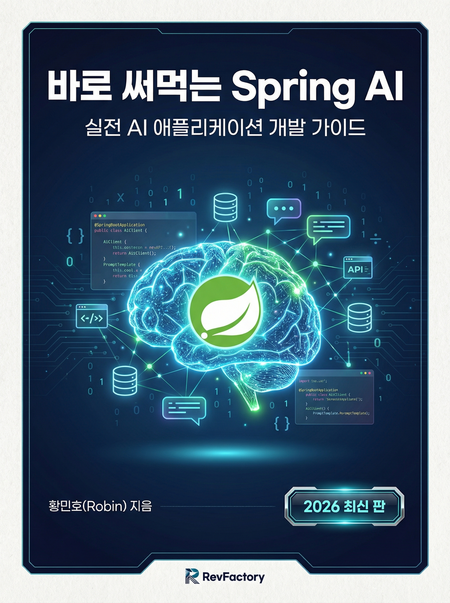
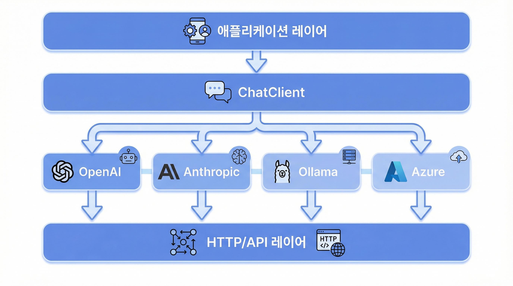
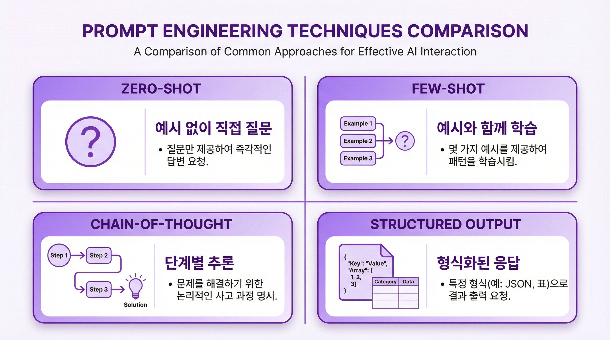
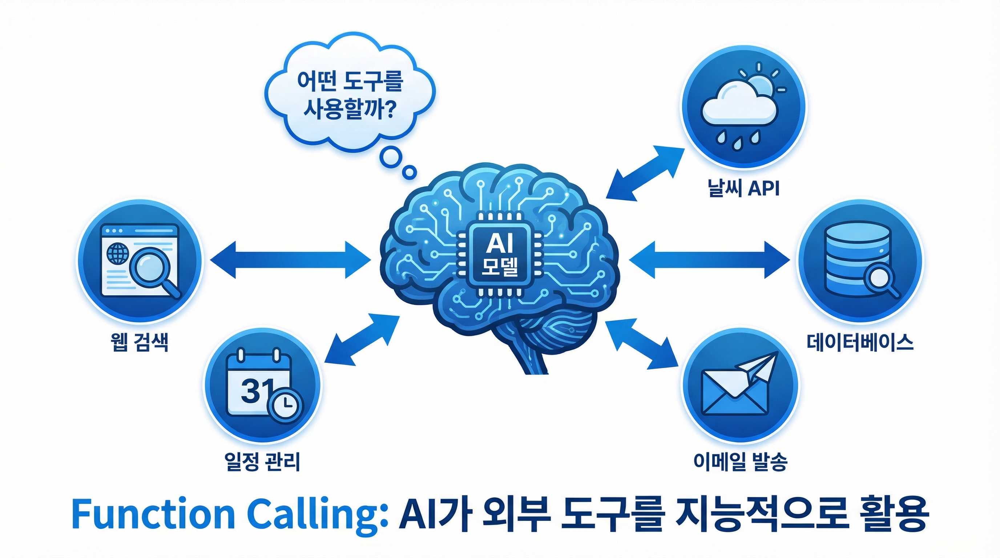
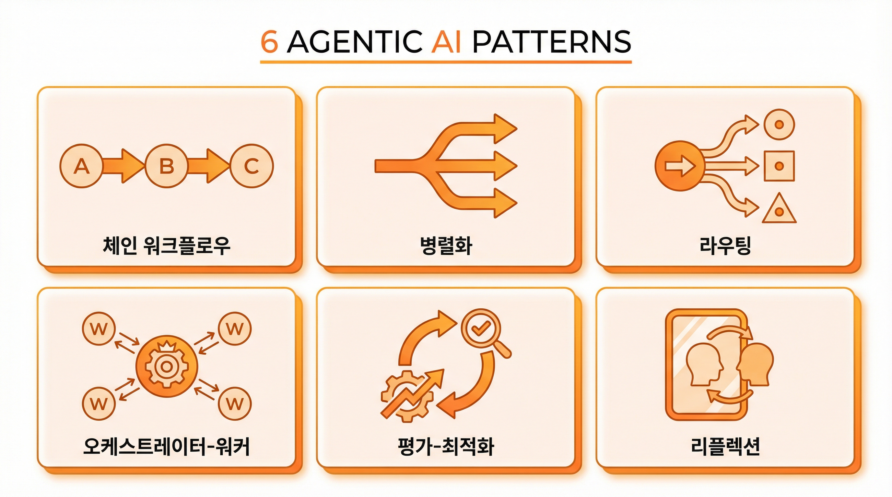
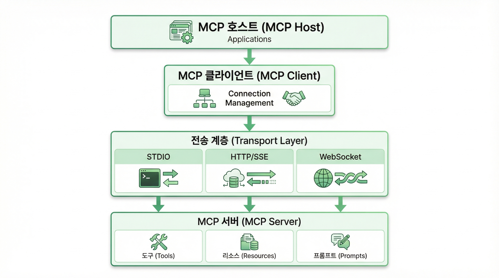

# 바로 써먹는 Spring AI

> Spring AI를 활용한 실전 AI 애플리케이션 개발 가이드

<p align="center">
  
</p>

<p align="center">
  <strong>황민호(Robin) 지음</strong><br>
  RevFactory | 2026 최신 판
</p>

<p align="center">
  <a href="output/바로_써먹는_Spring_AI.pdf">📥 PDF 다운로드</a>
</p>

---

## 이 책에 대하여

이 책은 **Spring AI**를 사용하여 AI 애플리케이션을 개발하는 방법을 단계별로 안내합니다. 기초부터 고급 패턴까지, 실제 사용할 수 있는 **Kotlin** 코드 예제와 함께 학습합니다.

### 특징

- **실전 중심**: 이론보다 실습을 강조합니다
- **Kotlin 예제**: 모든 코드는 Kotlin으로 작성되었습니다
- **인포그래픽**: 복잡한 개념을 그림으로 이해합니다
- **단계별 진행**: Part 1부터 5까지 순서대로 학습합니다

---

## 목차

### Part 1: Spring AI 입문
> Spring AI의 기초를 배웁니다

**[Part 1 바로가기](chapters/part1-foundation.md)**

- Module 1.1: Spring AI 소개와 환경 구성
- Module 1.2: ChatClient 기초
- Module 1.3: Streaming 응답 처리



---

### Part 2: 프롬프트 엔지니어링
> 효과적인 프롬프트 작성법을 배웁니다

**[Part 2 바로가기](chapters/part2-prompt-engineering.md)**

- Module 2.1: 프롬프트 템플릿과 변수
- Module 2.2: Structured Output
- Module 2.3: 고급 프롬프트 기법



---

### Part 3: Function Calling과 도구 통합
> AI에 실행 능력을 부여합니다

**[Part 3 바로가기](chapters/part3-function-calling.md)**

- Module 3.1: Function Calling 기초
- Module 3.2: 실전 Function Calling 패턴
- Module 3.3: Advisors 패턴



---

### Part 4: Agentic Patterns
> 자율적인 AI 에이전트를 구축합니다

**[Part 4 바로가기](chapters/part4-agentic-patterns.md)**

- Module 4.1: Chain Workflow
- Module 4.2: Parallelization Workflow
- Module 4.3: Routing Workflow
- Module 4.4: Orchestrator-Workers
- Module 4.5: Evaluator-Optimizer
- Module 4.6: Reflection Agent



---

### Part 5: Model Context Protocol (MCP)
> 표준화된 AI 도구 통합을 배웁니다

**[Part 5 바로가기](chapters/part5-mcp.md)**

- Module 5.1: MCP 개요와 아키텍처
- Module 5.2: MCP Server 구축 (WebMVC)
- Module 5.3: MCP Server 구축 (WebFlux)
- Module 5.4: MCP Server 구축 (STDIO)
- Module 5.5: MCP Client 구현
- Module 5.6: MCP Annotations 기반 개발
- Module 5.7: MCP Sampling
- Module 5.8: Dynamic Tool Update
- Module 5.9: 실전 MCP 통합



---

## 학습 로드맵

```
Week 1-2:   Part 1 (입문)
               │
               ▼
Week 3-4:   Part 2 (프롬프트 엔지니어링)
               │
               ▼
Week 5-6:   Part 3 (Function Calling)
               │
               ▼
Week 7-9:   Part 4 (Agentic Patterns)
               │
               ▼
Week 10-12: Part 5 (MCP)
               │
               ▼
Week 13-14: Capstone Project
```

**총 학습 기간:** 12주 (+ Capstone 2주)

---

## 사전 요구사항

### 기술적 요구사항
- Java 17 이상
- Kotlin 기본 지식
- Spring Boot 기본 지식
- Maven 또는 Gradle 사용 경험
- REST API 개발 경험

### 환경 설정

```bash
# API 키 설정
export OPENAI_API_KEY=sk-...
export ANTHROPIC_API_KEY=sk-ant-...

# (선택) 로컬 모델 설치
ollama pull llama3.2
```

---

## 예제 코드

이 책의 모든 예제 코드는 `spring-ai-examples` 저장소에서 찾을 수 있습니다:

```
spring-ai-examples/
├── models/chat/helloworld           → Part 1
├── misc/openai-streaming-response   → Part 1
├── prompt-engineering/              → Part 2
├── misc/spring-ai-java-function-callback → Part 3
├── advisors/                        → Part 3
├── agentic-patterns/                → Part 4
├── agents/reflection                → Part 4
└── model-context-protocol/          → Part 5
```

---

## 이 책의 구조

각 Part는 다음 구조로 구성되어 있습니다:

1. **개념 설명**: 핵심 개념을 친절하게 설명합니다
2. **인포그래픽**: 복잡한 구조를 시각화합니다
3. **코드 예제**: Kotlin으로 작성된 실전 코드를 제공합니다
4. **실습**: 직접 구현해 볼 수 있는 과제를 제시합니다
5. **요약**: 학습 내용을 정리합니다

---

## 🤝 기여하기

이 프로젝트는 오픈소스입니다! 기여를 환영합니다.

### 기여 방법

- 📝 오타나 개선사항 발견 시 Issue 등록
- 🔀 Pull Request로 직접 수정 제안
- 🌟 별표를 눌러 프로젝트 응원
- 📢 동료 개발자들에게 공유

---

## 📄 저작권 및 라이선스

© 2025 황민호 (robin.hwang@kakaocorp.com). All rights reserved.

**무단 배포 금지**: 이 저작물의 무단 복제, 배포, 전송, 출판은 저작권법에 의해 금지되어 있습니다.

### 허용 범위

- ✅ 개인적 학습 및 연구 목적의 열람
- ✅ 비상업적 교육 목적의 인용 (출처 명시 시)
- ✅ GitHub Issues를 통한 오탈자 제보 및 개선 제안

### 금지 사항

- ❌ 상업적 목적의 사용, 복제, 배포
- ❌ 저작자 동의 없는 2차 저작물 제작
- ❌ 전체 또는 일부 내용의 무단 전재

---

**즐거운 Spring AI 학습 되세요!**
