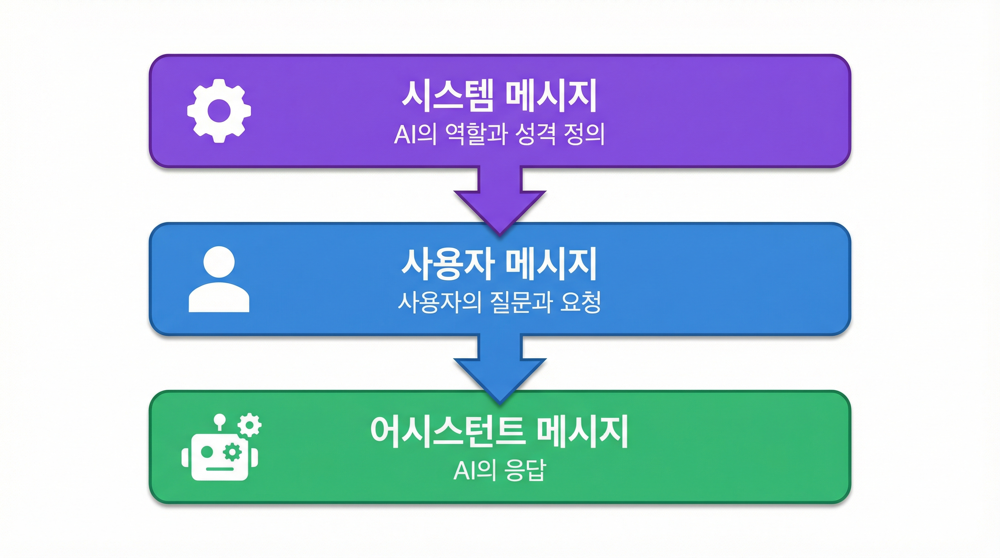
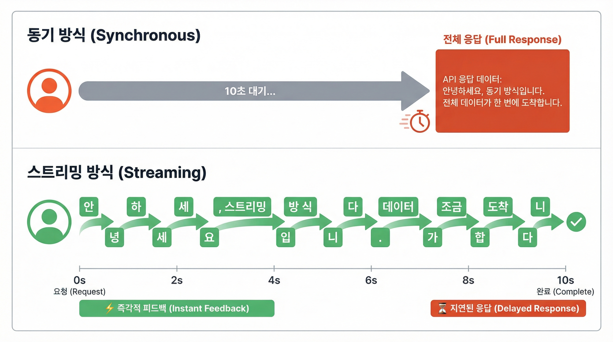

# Part 1: Spring AI 입문 (Foundation)

> AI 애플리케이션 개발의 첫 걸음을 함께 떼어봅시다

**학습 기간:** 2주
**난이도:** 초급
**사전 요구사항:** Spring Boot 기본 지식, Kotlin 문법 이해

---

## 들어가며

인공지능이 우리 일상에 깊숙이 들어온 시대입니다. ChatGPT, Claude와 같은 대화형 AI 서비스를 한 번쯤 사용해보셨을 텐데요, 이런 AI의 강력한 능력을 여러분의 애플리케이션에 직접 통합할 수 있다면 어떨까요?

Spring AI는 바로 이런 꿈을 현실로 만들어주는 프레임워크입니다. 마치 Spring Data JPA가 데이터베이스 연동을 쉽게 만들어준 것처럼, Spring AI는 AI 모델과의 통합을 놀라울 정도로 간단하게 만들어줍니다.

이 장에서는 Spring AI의 기초를 탄탄히 다지며, 여러분만의 첫 번째 AI 애플리케이션을 만들어볼 것입니다.

---

## Module 1.1: Spring AI 소개와 환경 구성

### 1.1.1 Spring AI란 무엇인가?

#### Spring 생태계에서의 AI 통합

Spring AI는 2023년에 시작된 비교적 새로운 프로젝트입니다. 하지만 그 뒤에는 Spring 프레임워크 20년의 철학과 경험이 담겨 있습니다.

**기존 방식의 어려움:**
```kotlin
// 기존에는 각 AI 제공자마다 다른 SDK를 배워야 했습니다
// OpenAI SDK
val openai = OpenAIClient(apiKey)
val response = openai.createChatCompletion(...)

// Anthropic SDK - 완전히 다른 API!
val anthropic = AnthropicClient(apiKey)
val response = anthropic.messages.create(...)
```

**Spring AI의 접근 방식:**
```kotlin
// Spring AI는 하나의 통합된 인터페이스를 제공합니다
@Service
class ChatService(private val chatClient: ChatClient) {

    fun chat(message: String): String {
        return chatClient.prompt()
            .user(message)
            .call()
            .content()
    }
}
// OpenAI든 Anthropic이든 동일한 코드!
```

이것이 바로 Spring AI의 핵심 가치입니다. **"한 번 배우고, 어디서나 사용한다"**는 Spring의 철학이 AI 영역에도 그대로 적용됩니다.

#### 핵심 개념 이해하기

Spring AI를 이해하기 위해 알아야 할 네 가지 핵심 개념이 있습니다:

| 개념 | 설명 | 비유 |
|------|------|------|
| **ChatModel** | AI 모델과의 저수준 인터페이스 | JDBC의 DataSource |
| **ChatClient** | 편리한 고수준 Fluent API | Spring Data의 Repository |
| **Prompt** | AI에게 전달하는 입력 | SQL 쿼리 |
| **ChatResponse** | AI로부터 받는 응답 | ResultSet |

#### 아키텍처 개요

Spring AI의 아키텍처를 시각적으로 이해해봅시다:


이 구조의 아름다움은 **ChatClient**라는 추상화 계층에 있습니다. 여러분의 비즈니스 코드는 ChatClient만 알면 되고, 실제로 어떤 AI 모델을 사용하는지는 설정 파일에서 결정됩니다. 나중에 OpenAI에서 Claude로 바꾸고 싶다면? 의존성과 설정만 변경하면 됩니다!

### 1.1.2 지원 AI 모델

Spring AI는 다양한 AI 제공자를 지원합니다. 각각의 특징을 알아봅시다. (2026년 1월 기준)

#### 클라우드 모델

| Provider | 모델 | 특징 | 추천 용도 |
|----------|------|------|----------|
| **OpenAI** | GPT-5.2, GPT-5.2-Codex, GPT-5-mini | 400K 컨텍스트, ARC-AGI 90%+, 최강 코딩 성능 | 복잡한 추론, 코드 생성, 에이전트 |
| **Anthropic** | Claude Opus 4.5, Claude Sonnet 4.5, Claude Haiku 4.5 | 200K 컨텍스트, 최고 수준의 코딩/에이전트 성능 | 긴 문서 분석, 코딩, 컴퓨터 사용 |
| **Google Vertex AI** | Gemini 3 Pro, Gemini 3 Flash | 1M 컨텍스트, PhD급 추론, 멀티모달 | 이미지/비디오 처리, 복잡한 추론 |
| **Azure OpenAI** | GPT 시리즈 | 엔터프라이즈급 보안 및 규정 준수 | 기업 환경, 데이터 주권이 중요한 경우 |
| **Amazon Bedrock** | Claude, Titan, Llama 등 | AWS 생태계 통합, 다양한 모델 선택 | AWS 인프라 사용 기업 |

#### 로컬 모델 (Ollama)

인터넷 연결 없이, 비용 걱정 없이 AI를 사용하고 싶다면 Ollama가 정답입니다!

| 모델 | 크기 | 용도 | 필요 VRAM |
|------|------|------|-----------|
| **DeepSeek R1** | 8B/671B | 추론 특화, O3급 성능 | 8GB+/다중GPU |
| **Qwen3** | 8B/32B/235B MoE | 다국어 지원, 코딩, 에이전트 | 8GB+/24GB+ |
| **Llama 4** | 8B/70B | 범용 작업, 상업적 사용 가능 | 8GB+/48GB+ |
| **Gemma 3** | 9B/27B | Google 경량 모델, 빠른 응답 | 8GB+/24GB+ |
| **GLM 4.7** | 9B/30B | 빠른 응답, 도구 호출 지원 | 8GB+/24GB+ |

> 💡 **팁**: 개발 단계에서는 Ollama로 무료로 테스트하고, 프로덕션에서만 유료 API를 사용하는 전략을 추천합니다! `ollama launch` 명령으로 Claude Code 등과 쉽게 연동할 수 있습니다. 

### 1.1.3 프로젝트 설정

#### Spring Initializr로 시작하기

가장 쉬운 방법은 [start.spring.io](https://start.spring.io)를 이용하는 것입니다:

```
Project: Gradle - Kotlin
Language: Kotlin
Spring Boot: 3.4.x
Dependencies:
  - Spring Web
  - Spring AI OpenAI (또는 Anthropic)
```

#### Gradle 설정 (Kotlin DSL)

```kotlin
// build.gradle.kts
plugins {   
    kotlin("jvm") version "1.9.25"
    kotlin("plugin.spring") version "1.9.25"
    id("org.springframework.boot") version "3.5.10"
    id("io.spring.dependency-management") version "1.1.7"
}

extra["springAiVersion"] = "1.1.2"

dependencies {

    // OpenAI 사용 시
    implementation("org.springframework.ai:spring-ai-starter-model-openai")

    // 또는 Anthropic 사용 시
    // implementation("org.springframework.ai:spring-ai-starter-model-anthropic")
 
    // 또는 Google Gemini 사용 시
    // implementation("org.springframework.ai:spring-ai-starter-model-google-genai")
 
    // 기본 의존성
    implementation("org.springframework.boot:spring-boot-starter-web")
    implementation("org.springframework.boot:spring-boot-starter-webflux")
    implementation("com.fasterxml.jackson.module:jackson-module-kotlin")
    implementation("io.projectreactor.kotlin:reactor-kotlin-extensions")
    implementation("org.jetbrains.kotlin:kotlin-reflect")
    implementation("org.jetbrains.kotlinx:kotlinx-coroutines-reactor")

    testImplementation("org.springframework.boot:spring-boot-starter-test")
    testImplementation("io.projectreactor:reactor-test")
    testImplementation("org.jetbrains.kotlin:kotlin-test-junit5")
    testImplementation("org.jetbrains.kotlinx:kotlinx-coroutines-test")
    testRuntimeOnly("org.junit.platform:junit-platform-launcher")
}

dependencyManagement {
 imports {
  mavenBom("org.springframework.ai:spring-ai-bom:${property("springAiVersion")}")
 }
}

```

### 1.1.4 API 키 관리

#### 환경 변수 설정

API 키는 절대로 코드에 직접 작성하면 안 됩니다! 환경 변수로 관리하세요:

```bash
# ~/.zshrc 또는 ~/.bashrc에 추가
export OPENAI_API_KEY=sk-proj-xxxxx
export ANTHROPIC_API_KEY=sk-ant-xxxxx
export GEMINI_API_KEY=
```

#### application.yml 설정

```yaml
spring:
  ai:
    openai:
      api-key: ${OPENAI_API_KEY}
      chat:
        options:
          model: gpt-5.2
```

> ⚠️ **보안 경고**: API 키가 Git에 커밋되지 않도록 `.gitignore`에 환경 파일을 추가하세요!

```gitignore
# .gitignore
.env
application-local.yml
```

### 1.1.5 실습: Hello Spring AI

드디어 첫 번째 Spring AI 애플리케이션을 만들어봅시다!

#### 프로젝트 구조

```
src/main/kotlin/com/example/helloai/
├── HelloAiApplication.kt
├── controller/
│   └── ChatController.kt
└── service/
    └── ChatService.kt
```

#### 메인 애플리케이션

```kotlin
// HelloAiApplication.kt
package com.example.helloai

import org.springframework.boot.autoconfigure.SpringBootApplication
import org.springframework.boot.runApplication

@SpringBootApplication
class HelloAiApplication

fun main(args: Array<String>) {
    runApplication<HelloAiApplication>(*args)
}
```

#### 서비스 레이어

```kotlin
// service/ChatService.kt
package com.example.helloai.service

import org.springframework.ai.chat.client.ChatClient
import org.springframework.stereotype.Service

@Service
class ChatService(chatClientBuilder: ChatClient.Builder) {

    // ChatClient.Builder를 주입받아 ChatClient를 생성합니다
    private val chatClient: ChatClient = chatClientBuilder
        .defaultSystem("당신은 친절하고 도움이 되는 AI 비서입니다. 한국어로 답변해주세요.")
        .build()

    fun chat(message: String): String {
        return chatClient.prompt()
            .user(message)  // 사용자 메시지 설정
            .call()         // AI 호출
            .content()!!      // 응답 내용 추출
    }
}
```

#### 컨트롤러

```kotlin
// controller/ChatController.kt
package com.example.helloai.controller

import com.example.helloai.service.ChatService
import org.springframework.web.bind.annotation.*

@RestController
@RequestMapping("/api/chat")
class ChatController(private val chatService: ChatService) {

    @GetMapping
    fun chat(@RequestParam message: String): String {
        return chatService.chat(message)
    }

    @PostMapping
    fun chatPost(@RequestBody request: ChatRequest): ChatResponse {
        val response = chatService.chat(request.message)
        return ChatResponse(response)
    }
}

data class ChatRequest(val message: String)
data class ChatResponse(val response: String)
```

#### 테스트해보기

```bash
# 서버 실행 후
curl "http://localhost:8080/api/chat?message=안녕하세요"

# 또는 POST 요청
curl -X POST http://localhost:8080/api/chat \
  -H "Content-Type: application/json" \
  -d '{"message": "Spring AI에 대해 설명해주세요"}'
```

축하합니다! 🎉 방금 여러분의 첫 번째 AI 애플리케이션을 만들었습니다!

---

## Module 1.2: ChatClient 기초

### 1.2.1 ChatClient 소개

#### ChatModel vs ChatClient

Spring AI는 두 가지 수준의 API를 제공합니다:

| 구분 | ChatModel | ChatClient |
|------|-----------|------------|
| **수준** | Low-level (저수준) | High-level (고수준) |
| **API 스타일** | 직접적, 명시적 | Fluent, 체이닝 |
| **사용성** | 복잡하지만 유연 | 간편하고 직관적 |
| **추천 대상** | 세밀한 제어 필요 시 | 대부분의 경우 |

대부분의 경우 **ChatClient**를 사용하는 것이 좋습니다. 코드가 훨씬 읽기 쉽고 유지보수하기 편합니다.

#### ChatClient 생성 방법

```kotlin
@Service
class ChatService(chatClientBuilder: ChatClient.Builder) {

    // 방법 1: Builder 주입 (권장)
    private val chatClient = chatClientBuilder
        .defaultSystem("기본 시스템 프롬프트")
        .build()

    // 방법 2: ChatModel에서 직접 생성 (필요한 경우에만)
    // private val chatClient = ChatClient.create(chatModel)
}
```

> 💡 **왜 Builder를 주입받나요?**
>
> `ChatClient.Builder`를 주입받으면 Spring Boot의 자동 설정이 적용된 상태에서 시작합니다.
> API 키, 모델 설정 등이 이미 구성되어 있어서 추가 설정 없이 바로 사용할 수 있습니다.

### 1.2.2 메시지 역할 이해하기

AI 대화에서는 세 가지 역할의 메시지가 있습니다:



| 역할 | 설명 | 예시 |
|------|------|------|
| **System Message** | AI의 성격, 역할, 제약사항을 정의합니다. 대화 전체에 영향을 미칩니다. | "당신은 전문 번역가입니다" |
| **User Message** | 사용자가 AI에게 하는 질문이나 요청입니다. | "이 문장을 영어로 번역해주세요" |
| **Assistant Message** | AI의 이전 응답입니다. 대화 이력을 유지하는 데 사용됩니다. | "Here is the translation..." |

#### System Message 활용

```kotlin
// AI의 역할을 명확히 정의합니다
val response = chatClient.prompt()
    .system("당신은 전문 번역가입니다. 모든 입력을 자연스러운 한국어로 번역해주세요.")
    .user("Hello, how are you today?")
    .call()
    .content()

// 결과: "안녕하세요, 오늘 기분이 어떠세요?"
```

#### 대화 이력 유지하기

```kotlin
import org.springframework.ai.chat.messages.*

// 이전 대화 내용을 포함시켜 컨텍스트를 유지합니다
val response = chatClient.prompt()
    .system("당신은 친절한 AI 비서입니다.")
    .messages(
        UserMessage("제 이름은 철수입니다"),
        AssistantMessage("안녕하세요 철수님! 만나서 반갑습니다."),
        UserMessage("제 이름이 뭐라고 했죠?")
    )
    .call()
    .content()

// 결과: "철수님이라고 하셨습니다."
```

### 1.2.3 다양한 호출 방식

#### 동기 호출 - call()

가장 기본적인 호출 방식입니다. 전체 응답이 완료될 때까지 기다립니다.

```kotlin
// 간단한 텍스트 응답
val content: String = chatClient.prompt()
    .user("농담 하나 해주세요")
    .call()
    .content()

// 전체 ChatResponse 객체가 필요한 경우
val response: ChatResponse = chatClient.prompt()
    .user("안녕하세요")
    .call()
    .chatResponse()

// 메타데이터 확인 (토큰 사용량 등)
println("사용된 토큰: ${response.metadata.usage.totalTokens}")
```

#### 구조화된 응답 - entity()

AI 응답을 자동으로 Kotlin 객체로 변환할 수 있습니다! (이 기능은 Part 2에서 자세히 다룹니다)

```kotlin
// 응답 형식 정의
data class Joke(
    val setup: String,    // 농담의 설정
    val punchline: String // 펀치라인
)

// AI가 자동으로 JSON 형태로 응답하고, 이를 객체로 변환합니다
val joke: Joke = chatClient.prompt()
    .user("프로그래머 농담 하나 해주세요")
    .call()
    .entity<Joke>()  // Kotlin의 reified type parameter 활용

println("설정: ${joke.setup}")
println("펀치라인: ${joke.punchline}")
```

### 1.2.4 모델 옵션 설정

#### Temperature (온도)

Temperature는 AI 응답의 창의성을 조절하는 가장 중요한 파라미터입니다.

```kotlin
import org.springframework.ai.openai.OpenAiChatOptions

// 창의적인 응답이 필요할 때 (예: 소설 쓰기)
val creativeResponse = chatClient.prompt()
    .user("외계인이 지구에 오는 SF 소설의 첫 문장을 써주세요")
    .options(OpenAiChatOptions.builder()
        .temperature(0.9)  // 높을수록 창의적
        .build())
    .call()
    .content()

// 정확한 응답이 필요할 때 (예: 코드 생성)
val preciseResponse = chatClient.prompt()
    .user("퀵소트 알고리즘을 Kotlin으로 구현해주세요")
    .options(OpenAiChatOptions.builder()
        .temperature(0.1)  // 낮을수록 결정적
        .build())
    .call()
    .content()
```

#### 주요 옵션들

| 옵션 | 설명 | 범위 | 사용 예 |
|------|------|------|---------|
| `temperature` | 응답의 무작위성 | 0.0 ~ 2.0 | 창의적 글쓰기 vs 코드 생성 |
| `maxTokens` | 최대 응답 길이 | 1 ~ 모델 최대 | 짧은 답변 vs 긴 설명 |
| `topP` | 누적 확률 샘플링 | 0.0 ~ 1.0 | 다양성 조절 |
| `frequencyPenalty` | 반복 억제 | -2.0 ~ 2.0 | 같은 단어 반복 방지 |
| `presencePenalty` | 새 토픽 유도 | -2.0 ~ 2.0 | 다양한 주제 탐색 |

### 1.2.5 에러 처리

AI API 호출은 네트워크를 사용하므로 다양한 오류가 발생할 수 있습니다:

```kotlin
import org.springframework.ai.retry.*

@Service
class RobustChatService(chatClientBuilder: ChatClient.Builder) {

    private val chatClient = chatClientBuilder.build()

    fun chat(message: String): String {
        return try {
            chatClient.prompt()
                .user(message)
                .call()
                .content()
        } catch (e: NonTransientAiException) {
            // 재시도해도 해결되지 않는 오류 (잘못된 API 키, 잘못된 요청 등)
            logger.error("AI API 오류: ${e.message}")
            "죄송합니다. 요청을 처리할 수 없습니다."
        } catch (e: TransientAiException) {
            // 일시적 오류 (네트워크 문제, 서버 과부하 등) - 재시도 가능
            logger.warn("일시적 오류 발생, 재시도 중...")
            throw e  // Spring Retry가 처리하도록 위임
        }
    }

    companion object {
        private val logger = LoggerFactory.getLogger(RobustChatService::class.java)
    }
}
```

#### 자동 재시도 설정

```yaml
# application.yml
spring:
  ai:
    retry:
      max-attempts: 3                    # 최대 재시도 횟수
      backoff:
        initial-interval: 1000           # 첫 재시도까지 대기 시간 (ms)
        multiplier: 2                    # 대기 시간 증가 배수
        max-interval: 10000              # 최대 대기 시간 (ms)
```

### 1.2.6 실습: 대화 컨텍스트를 유지하는 챗봇

실제 챗봇처럼 이전 대화 내용을 기억하는 서비스를 만들어봅시다!

```kotlin
// service/ConversationService.kt
package com.example.helloai.service

import org.springframework.ai.chat.client.ChatClient
import org.springframework.ai.chat.messages.*
import org.springframework.stereotype.Service
import java.util.concurrent.ConcurrentHashMap

@Service
class ConversationService(chatClientBuilder: ChatClient.Builder) {

    private val chatClient = chatClientBuilder
        .defaultSystem("""
            당신은 친절하고 도움이 되는 AI 비서입니다.
            사용자의 이전 대화 내용을 기억하고 참조하여 응답해주세요.
            한국어로 자연스럽게 대화합니다.
        """.trimIndent())
        .build()

    // 세션별 대화 이력 저장소
    private val conversations = ConcurrentHashMap<String, MutableList<Message>>()

    // 최대 저장할 메시지 수 (메모리 관리)
    private val maxHistory = 20

    fun chat(sessionId: String, userMessage: String): String {
        // 1. 해당 세션의 대화 이력 가져오기 (없으면 새로 생성)
        val history = conversations.computeIfAbsent(sessionId) { mutableListOf() }

        // 2. 사용자 메시지 추가
        history.add(UserMessage(userMessage))

        // 3. 이력이 너무 길면 오래된 메시지 제거
        while (history.size > maxHistory) {
            history.removeAt(0)
        }

        // 4. AI 호출 (전체 대화 이력 포함)
        val response = chatClient.prompt()
            .messages(history)
            .call()
            .content()

        // 5. AI 응답도 이력에 추가
        history.add(AssistantMessage(response))

        return response
    }

    // 대화 이력 초기화
    fun clearHistory(sessionId: String) {
        conversations.remove(sessionId)
    }

    // 특정 세션의 대화 이력 조회
    fun getHistory(sessionId: String): List<Message> {
        return conversations[sessionId]?.toList() ?: emptyList()
    }
}
```

#### 컨트롤러 업데이트

```kotlin
// controller/ConversationController.kt
@RestController
@RequestMapping("/api/conversation")
class ConversationController(private val conversationService: ConversationService) {

    @PostMapping("/{sessionId}")
    fun chat(
        @PathVariable sessionId: String,
        @RequestBody request: ChatRequest
    ): ChatResponse {
        val response = conversationService.chat(sessionId, request.message)
        return ChatResponse(response)
    }

    @DeleteMapping("/{sessionId}")
    fun clearHistory(@PathVariable sessionId: String) {
        conversationService.clearHistory(sessionId)
    }
}
```

#### 테스트 시나리오

```bash
# 첫 번째 대화
curl -X POST http://localhost:8080/api/conversation/user123 \
  -H "Content-Type: application/json" \
  -d '{"message": "안녕! 내 이름은 민수야"}'
# 응답: "안녕하세요 민수님! 만나서 반갑습니다..."

# 두 번째 대화 - AI가 이름을 기억합니다!
curl -X POST http://localhost:8080/api/conversation/user123 \
  -H "Content-Type: application/json" \
  -d '{"message": "내 이름이 뭐라고 했지?"}'
# 응답: "민수라고 하셨습니다!"

# 대화 초기화
curl -X DELETE http://localhost:8080/api/conversation/user123
```

---

## Module 1.3: Streaming 응답 처리

### 1.3.1 Streaming이 필요한 이유

ChatGPT를 사용해보셨다면, 응답이 한 글자씩 타이핑되듯이 나타나는 것을 보셨을 겁니다. 이것이 바로 **스트리밍**입니다.

#### 왜 스트리밍을 사용할까요?



| 방식 | 동작 | 사용자 경험 |
|------|------|------------|
| **동기 방식 (call)** | 전체 응답이 완료될 때까지 대기 | 10초 동안 아무것도 안 보이다가 한꺼번에 표시 |
| **스트리밍 방식 (stream)** | 응답이 생성되는 대로 즉시 전송 | 즉시 응답 시작, 자연스러운 대화감 |

**스트리밍의 장점:**
1. **즉각적인 피드백**: 사용자가 기다리는 느낌이 줄어듭니다
2. **자연스러운 대화감**: 실제 대화처럼 느껴집니다
3. **타임아웃 방지**: 긴 응답도 연결이 끊기지 않습니다
4. **조기 중단 가능**: 원하지 않는 응답은 중간에 취소할 수 있습니다

### 1.3.2 Flux 기반 스트리밍

Spring AI에서 스트리밍은 Reactor의 `Flux`를 사용합니다.

```kotlin
import reactor.core.publisher.Flux

@Service
class StreamingChatService(chatClientBuilder: ChatClient.Builder) {

    private val chatClient = chatClientBuilder.build()

    // 텍스트 스트리밍
    fun streamChat(message: String): Flux<String> {
        return chatClient.prompt()
            .user(message)
            .stream()          // call() 대신 stream() 사용!
            .content()         // Flux<String> 반환
    }

    // ChatResponse 스트리밍 (메타데이터 포함)
    fun streamChatWithMetadata(message: String): Flux<ChatResponse> {
        return chatClient.prompt()
            .user(message)
            .stream()
            .chatResponse()
    }
}
```

### 1.3.3 Server-Sent Events (SSE)

웹 브라우저에서 스트리밍을 받으려면 SSE를 사용합니다.

```kotlin
// controller/StreamingController.kt
import org.springframework.http.MediaType
import org.springframework.http.codec.ServerSentEvent
import reactor.core.publisher.Flux

@RestController
@RequestMapping("/api/stream")
class StreamingController(private val streamingService: StreamingChatService) {

    // 기본 SSE 스트리밍
    @GetMapping(produces = [MediaType.TEXT_EVENT_STREAM_VALUE])
    fun streamChat(@RequestParam message: String): Flux<String> {
        return streamingService.streamChat(message)
    }

    // ServerSentEvent 객체로 감싸서 더 많은 정보 전달
    @GetMapping("/sse", produces = [MediaType.TEXT_EVENT_STREAM_VALUE])
    fun streamChatSSE(@RequestParam message: String): Flux<ServerSentEvent<StreamChunk>> {
        var tokenCount = 0

        return streamingService.streamChat(message)
            .map { content ->
                tokenCount++
                ServerSentEvent.builder<StreamChunk>()
                    .event("message")
                    .data(StreamChunk(content, tokenCount, false))
                    .build()
            }
            .concatWith(
                Flux.just(
                    ServerSentEvent.builder<StreamChunk>()
                        .event("complete")
                        .data(StreamChunk("", tokenCount, true))
                        .build()
                )
            )
    }
}

data class StreamChunk(
    val content: String,
    val tokenCount: Int,
    val done: Boolean
)
```

#### 프론트엔드에서 SSE 받기 (JavaScript)

```javascript
// 기본적인 EventSource 사용
function startChat(message) {
    const eventSource = new EventSource(
        `/api/stream/sse?message=${encodeURIComponent(message)}`
    );

    const responseDiv = document.getElementById('response');
    let fullResponse = '';

    // 메시지 이벤트 처리
    eventSource.addEventListener('message', (event) => {
        const data = JSON.parse(event.data);
        fullResponse += data.content;
        responseDiv.textContent = fullResponse;
    });

    // 완료 이벤트 처리
    eventSource.addEventListener('complete', (event) => {
        const data = JSON.parse(event.data);
        console.log(`완료! 총 ${data.tokenCount}개 청크 수신`);
        eventSource.close();
    });

    // 에러 처리
    eventSource.onerror = () => {
        console.error('SSE 연결 오류');
        eventSource.close();
    };
}
```

### 1.3.4 타임아웃 및 에러 처리

스트리밍에서도 에러 처리는 중요합니다:

```kotlin
import java.time.Duration
import java.util.concurrent.TimeoutException

@Service
class RobustStreamingService(chatClientBuilder: ChatClient.Builder) {

    private val chatClient = chatClientBuilder.build()

    fun streamWithTimeout(message: String): Flux<String> {
        return chatClient.prompt()
            .user(message)
            .stream()
            .content()
            // 30초 타임아웃
            .timeout(Duration.ofSeconds(30))
            // 타임아웃 발생 시 대체 메시지
            .onErrorResume(TimeoutException::class.java) { _ ->
                Flux.just("[응답 시간이 초과되었습니다]")
            }
            // 기타 에러 처리
            .onErrorResume { e ->
                Flux.just("[오류 발생: ${e.message}]")
            }
            // 완료 및 취소 로깅
            .doOnComplete { println("스트리밍 완료") }
            .doOnCancel { println("스트리밍 취소됨") }
    }
}
```

### 1.3.5 실습: 실시간 타이핑 효과 챗봇

실제 ChatGPT처럼 동작하는 웹 챗봇을 만들어봅시다!

#### 백엔드 (Kotlin)

```kotlin
// controller/RealtimeChatController.kt
@RestController
@RequestMapping("/api/realtime")
class RealtimeChatController(chatClientBuilder: ChatClient.Builder) {

    private val chatClient = chatClientBuilder
        .defaultSystem("친절하고 자세하게 답변하는 AI 비서입니다.")
        .build()

    @GetMapping("/chat", produces = [MediaType.TEXT_EVENT_STREAM_VALUE])
    fun realtimeChat(
        @RequestParam message: String,
        @RequestParam(defaultValue = "default") sessionId: String
    ): Flux<ServerSentEvent<ChatChunk>> {

        val startTime = System.currentTimeMillis()
        var chunkCount = 0

        return chatClient.prompt()
            .user(message)
            .stream()
            .content()
            .map { content ->
                chunkCount++
                ServerSentEvent.builder<ChatChunk>()
                    .event("chunk")
                    .data(ChatChunk(
                        content = content,
                        chunkIndex = chunkCount,
                        done = false
                    ))
                    .build()
            }
            .concatWith(Flux.defer {
                val duration = System.currentTimeMillis() - startTime
                Flux.just(
                    ServerSentEvent.builder<ChatChunk>()
                        .event("done")
                        .data(ChatChunk(
                            content = "",
                            chunkIndex = chunkCount,
                            done = true,
                            totalChunks = chunkCount,
                            durationMs = duration
                        ))
                        .build()
                )
            })
            .onErrorResume { e ->
                Flux.just(
                    ServerSentEvent.builder<ChatChunk>()
                        .event("error")
                        .data(ChatChunk(
                            content = "오류: ${e.message}",
                            chunkIndex = -1,
                            done = true,
                            error = true
                        ))
                        .build()
                )
            }
    }
}

data class ChatChunk(
    val content: String,
    val chunkIndex: Int,
    val done: Boolean,
    val totalChunks: Int? = null,
    val durationMs: Long? = null,
    val error: Boolean = false
)
```

#### 프론트엔드 (HTML + JavaScript)

```html
<!DOCTYPE html>
<html lang="ko">
<head>
    <meta charset="UTF-8">
    <title>Spring AI 실시간 챗봇</title>
    <style>
        * { box-sizing: border-box; }
        body {
            font-family: -apple-system, BlinkMacSystemFont, 'Segoe UI', sans-serif;
            max-width: 800px;
            margin: 0 auto;
            padding: 20px;
            background: #f5f5f5;
        }
        .chat-container {
            background: white;
            border-radius: 12px;
            padding: 20px;
            box-shadow: 0 2px 10px rgba(0,0,0,0.1);
        }
        .input-area {
            display: flex;
            gap: 10px;
            margin-bottom: 20px;
        }
        #messageInput {
            flex: 1;
            padding: 12px 16px;
            border: 1px solid #ddd;
            border-radius: 8px;
            font-size: 16px;
        }
        button {
            padding: 12px 24px;
            border: none;
            border-radius: 8px;
            font-size: 16px;
            cursor: pointer;
            transition: all 0.2s;
        }
        #sendBtn {
            background: #007AFF;
            color: white;
        }
        #sendBtn:hover { background: #0056b3; }
        #sendBtn:disabled { background: #ccc; }
        #stopBtn {
            background: #FF3B30;
            color: white;
        }
        #stopBtn:disabled { background: #ccc; }
        .response-area {
            min-height: 200px;
            padding: 20px;
            background: #f9f9f9;
            border-radius: 8px;
            white-space: pre-wrap;
            font-size: 15px;
            line-height: 1.6;
        }
        .typing-indicator::after {
            content: '▌';
            animation: blink 1s infinite;
        }
        @keyframes blink { 50% { opacity: 0; } }
        .status {
            margin-top: 10px;
            font-size: 13px;
            color: #666;
        }
    </style>
</head>
<body>
    <div class="chat-container">
        <h1>🤖 Spring AI 챗봇</h1>
        <div class="input-area">
            <input type="text" id="messageInput" placeholder="메시지를 입력하세요..."
                   onkeypress="if(event.key==='Enter') sendMessage()">
            <button id="sendBtn" onclick="sendMessage()">전송</button>
            <button id="stopBtn" onclick="stopStream()" disabled>중단</button>
        </div>
        <div id="response" class="response-area">
            AI의 응답이 여기에 표시됩니다...
        </div>
        <div id="status" class="status"></div>
    </div>

    <script>
        let eventSource = null;
        let fullResponse = '';

        function sendMessage() {
            const message = document.getElementById('messageInput').value.trim();
            if (!message) return;

            const responseDiv = document.getElementById('response');
            const statusDiv = document.getElementById('status');

            // UI 초기화
            responseDiv.innerHTML = '';
            responseDiv.classList.add('typing-indicator');
            fullResponse = '';

            // 버튼 상태 변경
            document.getElementById('sendBtn').disabled = true;
            document.getElementById('stopBtn').disabled = false;

            statusDiv.textContent = '응답 생성 중...';

            // SSE 연결
            const encodedMessage = encodeURIComponent(message);
            eventSource = new EventSource(`/api/realtime/chat?message=${encodedMessage}`);

            eventSource.addEventListener('chunk', (event) => {
                const data = JSON.parse(event.data);
                fullResponse += data.content;
                responseDiv.innerHTML = fullResponse;
            });

            eventSource.addEventListener('done', (event) => {
                const data = JSON.parse(event.data);
                responseDiv.classList.remove('typing-indicator');
                statusDiv.textContent =
                    `완료! ${data.totalChunks}개 청크, ${data.durationMs}ms 소요`;
                cleanup();
            });

            eventSource.addEventListener('error', (event) => {
                const data = event.data ? JSON.parse(event.data) : {};
                responseDiv.classList.remove('typing-indicator');
                responseDiv.innerHTML += `\n\n⚠️ ${data.content || '연결 오류'}`;
                statusDiv.textContent = '오류 발생';
                cleanup();
            });

            eventSource.onerror = () => {
                if (eventSource.readyState === EventSource.CLOSED) {
                    cleanup();
                }
            };
        }

        function stopStream() {
            if (eventSource) {
                eventSource.close();
                document.getElementById('response').classList.remove('typing-indicator');
                document.getElementById('status').textContent = '사용자가 중단함';
                cleanup();
            }
        }

        function cleanup() {
            eventSource = null;
            document.getElementById('sendBtn').disabled = false;
            document.getElementById('stopBtn').disabled = true;
            document.getElementById('messageInput').value = '';
            document.getElementById('messageInput').focus();
        }
    </script>
</body>
</html>
```

이 HTML 파일을 `src/main/resources/static/index.html`에 저장하고 서버를 실행한 후 `http://localhost:8080`에 접속하면 실시간으로 응답이 타이핑되는 챗봇을 확인할 수 있습니다!

---

## Part 1 요약

### 이 파트에서 배운 것

#### 추상화를 통한 AI 통합의 단순화

Spring AI는 다양한 AI 제공자(OpenAI, Anthropic, Ollama 등)를 단일 인터페이스로 추상화합니다. 이 설계 철학은 Spring의 핵심 원칙인 **"인터페이스 기반 프로그래밍"**을 AI 영역에 적용한 것입니다. 개발자는 비즈니스 로직에 집중하고, AI 제공자 변경은 설정 파일 수정만으로 가능해집니다.

#### ChatClient: 선언적 AI 상호작용

ChatClient는 Spring WebClient의 설계 패턴을 계승하여 **빌더 패턴 기반의 Fluent API**를 제공합니다. 이를 통해 프롬프트 구성, API 호출, 응답 처리를 체이닝 방식으로 직관적으로 작성할 수 있습니다. 메시지 역할(System, User, Assistant)을 활용한 컨텍스트 관리는 AI의 행동을 제어하고 일관된 응답을 유도하는 핵심 메커니즘입니다.

#### 리액티브 스트리밍과 사용자 경험

동기 방식(`call()`)과 스트리밍 방식(`stream()`)의 선택은 단순한 기술적 결정이 아니라 **사용자 경험 설계**의 문제입니다. Project Reactor의 Flux를 활용한 스트리밍은 첫 토큰 응답 시간(TTFT, Time To First Token)을 최소화하여 체감 지연을 줄입니다. SSE(Server-Sent Events)와 WebSocket은 각각 단방향/양방향 실시간 통신의 표준 구현체로, 애플리케이션 요구사항에 따라 적절히 선택해야 합니다.

### 핵심 개념 정리

| 개념 | 설명 | 핵심 코드 |
|------|------|----------|
| **ChatClient** | AI 모델과 상호작용하는 고수준 API. Spring의 빌더 패턴을 따르며, 복잡한 AI 통신을 간단하게 추상화합니다. | `chatClient.prompt().user(msg).call().content()` |
| **Prompt** | AI에게 전달하는 메시지 구조. System(역할 정의), User(사용자 입력), Assistant(AI 응답) 세 가지 역할로 구성됩니다. | `.system("역할").user("질문")` |
| **call()** | 동기 방식 호출. 전체 응답이 완료될 때까지 블로킹됩니다. 간단한 요청이나 배치 처리에 적합합니다. | `.call().content()` |
| **stream()** | 비동기 스트리밍 방식. Project Reactor의 Flux를 반환하며, 응답이 생성되는 즉시 전달됩니다. | `.stream().content()` |

### 실전 활용 팁

#### ChatClient 사용 시
- **System 메시지는 한 번만**: 대화 시작 시 AI의 역할을 정의하고, 이후 대화에서는 변경하지 않는 것이 좋습니다
- **컨텍스트 관리**: 대화 이력이 길어지면 토큰 비용이 증가합니다. 필요한 이력만 유지하세요
- **에러 처리**: API 호출 실패에 대비해 적절한 예외 처리를 구현하세요

#### Streaming 사용 시
- **SSE vs WebSocket**: 단방향 실시간 전송에는 SSE가 적합하고, 양방향 통신이 필요하면 WebSocket을 선택하세요
- **타임아웃 설정**: 긴 응답에 대비해 충분한 타임아웃을 설정하세요
- **연결 관리**: 클라이언트 연결이 끊어졌을 때 리소스가 정리되도록 구현하세요

### 자주 하는 실수

| 실수 | 문제점 | 해결 방법 |
|------|--------|----------|
| API 키 하드코딩 | 보안 위험, 키 유출 가능성 | 환경 변수 또는 Spring Config 사용 |
| 대화 이력 무한 증가 | 토큰 한도 초과, 비용 증가 | 최근 N개 메시지만 유지 |
| 동기 호출로 긴 응답 처리 | UX 저하, 사용자 이탈 | Streaming 방식 사용 |
| System 메시지 누락 | AI 응답 품질 저하 | 역할과 제약사항 명확히 정의 |

### 학습 체크리스트

- [ ] Spring AI 프로젝트 생성 및 의존성 설정
- [ ] API 키 환경 변수 설정
- [ ] ChatClient 기본 사용법 이해
- [ ] 메시지 역할 (System, User, Assistant) 활용
- [ ] 대화 컨텍스트 유지 구현
- [ ] Streaming 응답 처리
- [ ] SSE 기반 실시간 채팅 구현

### 다음 단계

Part 1에서 ChatClient의 기본 사용법을 익혔다면, 이제 AI의 응답 품질을 높일 차례입니다.

**Part 2: 프롬프트 엔지니어링**에서 배울 내용:

| 주제 | 설명 | 활용 예시 |
|------|------|----------|
| **프롬프트 템플릿** | 변수를 포함한 재사용 가능한 프롬프트 작성 | 다국어 번역, 포맷 변환 |
| **Structured Output** | AI 응답을 Java/Kotlin 객체로 직접 매핑 | JSON API 응답, 데이터 추출 |
| **Few-shot Learning** | 예시를 통해 AI에게 원하는 형식 학습시키기 | 일관된 응답 형식 유지 |
| **Chain-of-Thought** | AI가 단계별로 추론하도록 유도 | 복잡한 문제 해결, 수학 계산 |

Part 1에서 다진 기초 위에 프롬프트 엔지니어링 기법을 더하면, AI 응답의 정확도와 일관성을 크게 향상시킬 수 있습니다!

---

## 참고 예제 코드

이 장의 개념들을 실제로 구현한 예제 코드:

```
spring-ai-examples/
├── kotlin/kotlin-hello-world          → ChatClient 기본 사용
├── models/chat/helloworld             → Java 버전 기본 예제
└── misc/openai-streaming-response     → Streaming 응답 처리
```

각 예제를 직접 실행해보며 학습한 내용을 확인해보세요!
