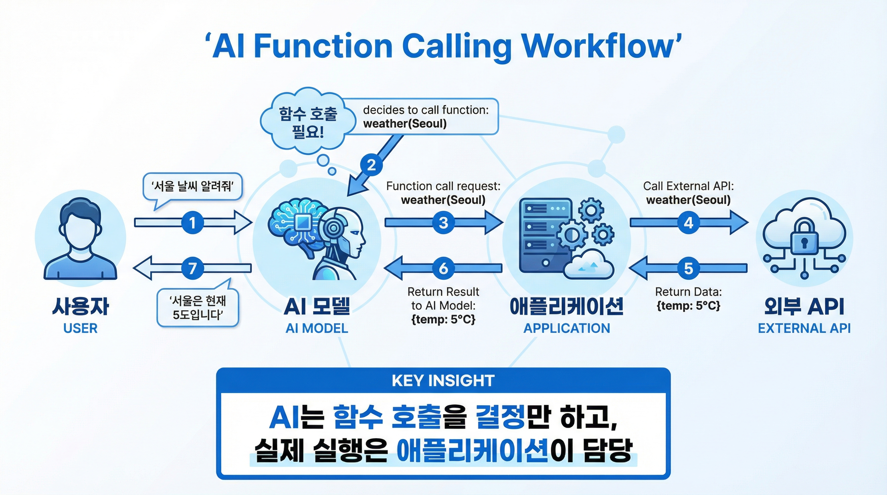
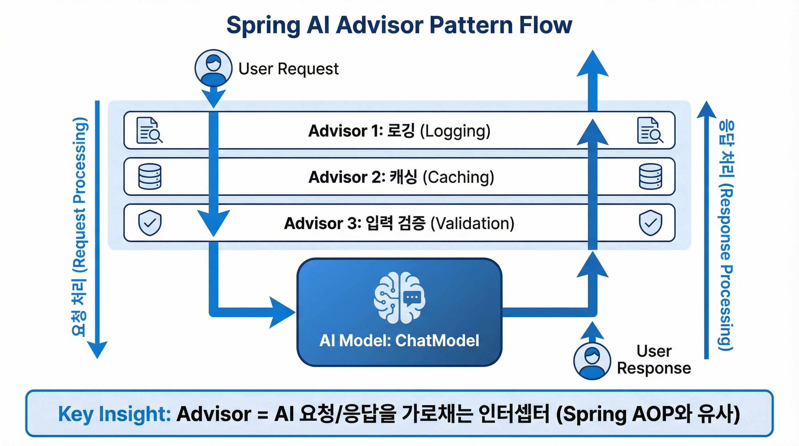

# Part 3: Function Calling과 도구 통합 (Tool Integration)

> AI에게 실제 행동 능력 부여하기

**학습 기간:** 2주
**난이도:** 중급
**사전 요구사항:** Part 1, 2 완료

---

## 들어가며

지금까지 AI는 텍스트를 생성하는 데 그쳤습니다. "서울 날씨가 어때?"라고 물으면 "제가 실시간 정보에 접근할 수 없어서 알 수 없습니다"라는 답변을 받았죠.

하지만 **Function Calling**을 사용하면 완전히 달라집니다. AI가 "서울 날씨를 알기 위해 weather() 함수를 호출해야겠다"고 판단하고, 실제로 날씨 API를 호출한 후, 그 결과를 바탕으로 "서울은 현재 5도이고 맑습니다"라고 답변할 수 있게 됩니다.

이것이 AI 에이전트의 시작입니다!


---

## Module 3.1: Function Calling 기초

### 3.1.1 Function Calling이란?

#### 핵심 개념

Function Calling은 AI가 **언제 어떤 함수를 호출할지 결정**하는 기능입니다.

중요한 점: AI가 함수를 직접 실행하는 것이 아닙니다!
- AI는 "이 함수를 이 인자로 호출해야 한다"는 **결정**만 합니다
- 실제 함수 실행은 **여러분의 애플리케이션**에서 수행합니다
- 결과를 다시 AI에게 전달하면 AI가 최종 응답을 생성합니다



| 단계 | 행위자 | 동작 |
|------|--------|------|
| 1 | 사용자 → AI | "서울 날씨 알려줘" 질문 전송 |
| 2 | AI | `weather("Seoul")` 함수 호출이 필요하다고 판단 |
| 3 | AI → 애플리케이션 | 함수 호출 요청 전달 |
| 4 | 애플리케이션 → 외부 API | 실제 날씨 API 호출 |
| 5 | 외부 API → 애플리케이션 | 날씨 데이터 반환 `{temp: 5°C}` |
| 6 | 애플리케이션 → AI | 함수 실행 결과 전달 |
| 7 | AI → 사용자 | 결과 기반 자연어 응답 생성 |

> **핵심 포인트**: AI는 함수 호출을 **결정**만 하고, 실제 실행은 **애플리케이션**이 담당합니다.

#### Function Calling vs RAG 비교

| 구분 | Function Calling | RAG |
|------|-----------------|-----|
| **목적** | 행동 수행 (Do Something) | 정보 검색 (Find Something) |
| **데이터** | 실시간, 동적 | 사전 색인, 정적 |
| **예시** | API 호출, DB 쿼리, 이메일 발송 | 문서 검색, FAQ 답변 |
| **비용** | 함수 호출 비용 발생 | 벡터 검색 비용 발생 |

### 3.1.2 Spring AI의 Function Callback

Spring AI에서는 함수를 `ToolCallback` 또는 `Function<Input, Output>` 형태로 정의합니다.

#### 요청/응답 데이터 클래스 정의

```kotlin
// 함수 입력 스키마
// AI가 이 구조를 보고 어떤 데이터를 전달해야 하는지 이해합니다
data class WeatherRequest(
    @get:JsonPropertyDescription("City name, e.g., 'Seoul', 'New York', 'Tokyo'")
    val location: String,

    @get:JsonPropertyDescription("Temperature unit: 'celsius' or 'fahrenheit'. Default is celsius.")
    val unit: String = "celsius"
)

// 함수 출력 스키마
data class WeatherResponse(
    val location: String,
    val temperature: Double,
    val unit: String,
    val condition: String,
    val humidity: Int,
    val timestamp: String = java.time.Instant.now().toString()
)
```

#### 함수 Bean 정의

```kotlin
import org.springframework.context.annotation.Bean
import org.springframework.context.annotation.Configuration
import org.springframework.context.annotation.Description
import java.util.function.Function

@Configuration
class WeatherFunctionConfig {

    @Bean
    @Description("Get current weather information for a specific location. Returns temperature, humidity, and weather conditions.")
    fun getWeather(weatherService: WeatherService): Function<WeatherRequest, WeatherResponse> {
        return Function { request ->
            weatherService.getWeather(request.location, request.unit)
        }
    }
}
```

> 💡 **@Description 어노테이션의 중요성**
>
> 이 설명은 AI가 함수를 이해하는 데 핵심적인 역할을 합니다.
> 명확하고 상세할수록 AI가 적절한 상황에서 함수를 호출합니다.

### 3.1.3 ChatClient에 함수 연결

#### 방법 1: 기본 함수 등록

```kotlin
@RestController
@RequestMapping("/api/weather-chat")
class WeatherChatController(
    chatClientBuilder: ChatClient.Builder
) {
    // Bean 이름으로 함수 등록 (전역 설정)
    private val chatClient = chatClientBuilder
        .defaultFunctions("getWeather")  // Bean 이름
        .defaultSystem("You are a helpful weather assistant. Use the weather function to get real-time weather data.")
        .build()

    @GetMapping
    fun chat(@RequestParam message: String): String {
        return chatClient.prompt()
            .user(message)
            .call()
            .content()
    }
}
```

#### 방법 2: 호출 시 동적 함수 지정

```kotlin
@GetMapping("/dynamic")
fun chatWithDynamicFunctions(
    @RequestParam message: String,
    @RequestParam(required = false) functions: List<String>?
): String {
    val prompt = chatClient.prompt().user(message)

    // 요청에 따라 다른 함수 세트 활성화
    if (functions != null && functions.isNotEmpty()) {
        prompt.functions(*functions.toTypedArray())
    }

    return prompt.call().content()
}
```

### 3.1.4 Kotlin 스타일 함수 정의

Kotlin의 람다와 함수 타입을 활용한 더 간결한 정의:

```kotlin
@Configuration
class KotlinFunctionConfig {

    @Bean
    @Description("Find the weather conditions, forecasts, and temperatures for a location")
    fun weatherFunction(weatherService: MockWeatherService): (WeatherRequest) -> WeatherResponse {
        return { request -> weatherService.getWeather(request) }
    }
}

// ToolCallback 빌더 사용
@Bean
fun weatherToolCallback(weatherService: MockWeatherService): ToolCallback {
    return FunctionToolCallback.builder("WeatherInfo") { request: WeatherRequest ->
        weatherService.getWeather(request)
    }
        .description("Get current weather for any city worldwide")
        .inputType(WeatherRequest::class.java)
        .build()
}
```

### 3.1.5 멀티 함수 시나리오

실제 애플리케이션에서는 여러 함수가 필요합니다:

```kotlin
@Configuration
class MultiFunctionConfig(
    private val weatherService: WeatherService,
    private val restaurantService: RestaurantService,
    private val reservationService: ReservationService
) {

    @Bean
    @Description("Get current weather for a location")
    fun getWeather(): (WeatherRequest) -> WeatherResponse = { req ->
        weatherService.getWeather(req.location, req.unit)
    }

    @Bean
    @Description("Search for restaurants by cuisine type and location")
    fun searchRestaurants(): (RestaurantSearchRequest) -> List<Restaurant> = { req ->
        restaurantService.search(req.cuisine, req.location, req.maxResults)
    }

    @Bean
    @Description("Make a restaurant reservation")
    fun makeReservation(): (ReservationRequest) -> ReservationResult = { req ->
        reservationService.book(req.restaurantId, req.partySize, req.dateTime)
    }
}

// 데이터 클래스들
data class RestaurantSearchRequest(
    @get:JsonPropertyDescription("Type of cuisine, e.g., 'Italian', 'Korean', 'Japanese'")
    val cuisine: String,
    @get:JsonPropertyDescription("City or area to search in")
    val location: String,
    @get:JsonPropertyDescription("Maximum number of results to return (default: 5)")
    val maxResults: Int = 5
)

data class Restaurant(
    val id: String,
    val name: String,
    val cuisine: String,
    val rating: Double,
    val priceRange: String,
    val address: String
)

data class ReservationRequest(
    @get:JsonPropertyDescription("Restaurant ID from search results")
    val restaurantId: String,
    @get:JsonPropertyDescription("Number of people")
    val partySize: Int,
    @get:JsonPropertyDescription("Desired date and time in ISO format")
    val dateTime: String
)

data class ReservationResult(
    val success: Boolean,
    val confirmationNumber: String?,
    val message: String
)
```

#### AI의 자동 함수 선택

```kotlin
@RestController
class TravelAssistantController(chatClientBuilder: ChatClient.Builder) {

    private val chatClient = chatClientBuilder
        .defaultFunctions("getWeather", "searchRestaurants", "makeReservation")
        .defaultSystem("""
            You are a helpful travel assistant.
            You can check weather, find restaurants, and make reservations.
            Always confirm with the user before making reservations.
        """.trimIndent())
        .build()

    @PostMapping("/travel-assistant")
    fun assist(@RequestBody request: AssistantRequest): String {
        return chatClient.prompt()
            .user(request.message)
            .call()
            .content()
    }
}

// 사용 예: "서울 강남에 있는 이탈리안 레스토랑 찾아서 내일 저녁 7시에 4명 예약해줘"
// AI 동작:
// 1. searchRestaurants(cuisine="Italian", location="강남", maxResults=5) 호출
// 2. 결과 중 적합한 레스토랑 선택
// 3. makeReservation(restaurantId="...", partySize=4, dateTime="...") 호출
// 4. 예약 결과를 사용자에게 안내
```

### 3.1.6 실습: 날씨 정보 챗봇

실제 날씨 API와 연동하는 완전한 예제:

```kotlin
// service/WeatherService.kt
@Service
class WeatherService(
    private val restTemplate: RestTemplate,
    @Value("\${weather.api.key}") private val apiKey: String
) {
    private val baseUrl = "https://api.openweathermap.org/data/2.5"

    fun getWeather(location: String, unit: String): WeatherResponse {
        val units = if (unit == "fahrenheit") "imperial" else "metric"

        val url = "$baseUrl/weather?q=$location&appid=$apiKey&units=$units"

        return try {
            val response = restTemplate.getForObject(url, OpenWeatherApiResponse::class.java)
                ?: throw WeatherApiException("No response from weather API")

            WeatherResponse(
                location = response.name,
                temperature = response.main.temp,
                unit = unit,
                condition = response.weather.firstOrNull()?.description ?: "Unknown",
                humidity = response.main.humidity
            )
        } catch (e: Exception) {
            // 에러 발생 시에도 AI가 처리할 수 있도록 응답 반환
            WeatherResponse(
                location = location,
                temperature = 0.0,
                unit = unit,
                condition = "Error: Unable to fetch weather data - ${e.message}",
                humidity = 0
            )
        }
    }

    fun getForecast(location: String, days: Int): ForecastResponse {
        val url = "$baseUrl/forecast?q=$location&appid=$apiKey&units=metric&cnt=${days * 8}"

        val response = restTemplate.getForObject(url, OpenWeatherForecastResponse::class.java)
            ?: throw WeatherApiException("No response from forecast API")

        return ForecastResponse(
            location = location,
            forecasts = response.list.map { item ->
                DailyForecast(
                    date = item.dt_txt,
                    temperature = item.main.temp,
                    condition = item.weather.firstOrNull()?.description ?: "Unknown"
                )
            }
        )
    }
}

// API 응답 매핑 클래스
data class OpenWeatherApiResponse(
    val name: String,
    val main: MainData,
    val weather: List<WeatherData>
)

data class MainData(val temp: Double, val humidity: Int)
data class WeatherData(val description: String)

// 예보 관련
data class ForecastResponse(
    val location: String,
    val forecasts: List<DailyForecast>
)

data class DailyForecast(
    val date: String,
    val temperature: Double,
    val condition: String
)
```

```kotlin
// config/WeatherFunctionConfig.kt
@Configuration
class WeatherFunctionConfig {

    @Bean
    @Description("Get current weather conditions for a city. Returns temperature, humidity, and weather description.")
    fun currentWeather(weatherService: WeatherService): (WeatherRequest) -> WeatherResponse = { request ->
        weatherService.getWeather(request.location, request.unit)
    }

    @Bean
    @Description("Get weather forecast for the next several days. Specify the city and number of days (1-5).")
    fun weatherForecast(weatherService: WeatherService): (ForecastRequest) -> ForecastResponse = { request ->
        weatherService.getForecast(request.location, request.days.coerceIn(1, 5))
    }

    @Bean
    @Description("Compare weather between two cities")
    fun compareWeather(weatherService: WeatherService): (CompareRequest) -> CompareResponse = { request ->
        val weather1 = weatherService.getWeather(request.city1, "celsius")
        val weather2 = weatherService.getWeather(request.city2, "celsius")

        CompareResponse(
            city1 = weather1,
            city2 = weather2,
            temperatureDifference = weather1.temperature - weather2.temperature,
            warmerCity = if (weather1.temperature > weather2.temperature) request.city1 else request.city2
        )
    }
}

data class ForecastRequest(
    @get:JsonPropertyDescription("City name")
    val location: String,
    @get:JsonPropertyDescription("Number of days for forecast (1-5)")
    val days: Int = 3
)

data class CompareRequest(
    @get:JsonPropertyDescription("First city to compare")
    val city1: String,
    @get:JsonPropertyDescription("Second city to compare")
    val city2: String
)

data class CompareResponse(
    val city1: WeatherResponse,
    val city2: WeatherResponse,
    val temperatureDifference: Double,
    val warmerCity: String
)
```

---

## Module 3.2: 실전 Function Calling 패턴

### 3.2.1 데이터베이스 연동 함수

```kotlin
@Configuration
class DatabaseFunctionConfig(
    private val customerRepository: CustomerRepository,
    private val orderRepository: OrderRepository
) {

    @Bean
    @Description("Look up customer information by ID or email")
    fun lookupCustomer(): (CustomerLookupRequest) -> CustomerInfo = { request ->
        val customer = when {
            request.customerId != null ->
                customerRepository.findById(request.customerId)
                    .orElseThrow { CustomerNotFoundException(request.customerId) }
            request.email != null ->
                customerRepository.findByEmail(request.email)
                    .orElseThrow { CustomerNotFoundException(request.email) }
            else ->
                throw IllegalArgumentException("Either customerId or email must be provided")
        }

        CustomerInfo(
            id = customer.id,
            name = customer.name,
            email = customer.email,
            memberSince = customer.createdAt.toString(),
            tier = customer.membershipTier
        )
    }

    @Bean
    @Description("Get customer's recent order history")
    fun getOrderHistory(): (OrderHistoryRequest) -> List<OrderSummary> = { request ->
        orderRepository.findByCustomerIdOrderByCreatedAtDesc(
            request.customerId,
            PageRequest.of(0, request.limit)
        ).map { order ->
            OrderSummary(
                orderId = order.id,
                date = order.createdAt.toString(),
                total = order.total,
                status = order.status.name,
                itemCount = order.items.size
            )
        }
    }
}

// 데이터 클래스들
data class CustomerLookupRequest(
    @get:JsonPropertyDescription("Customer ID (numeric)")
    val customerId: Long? = null,
    @get:JsonPropertyDescription("Customer email address")
    val email: String? = null
)

data class CustomerInfo(
    val id: Long,
    val name: String,
    val email: String,
    val memberSince: String,
    val tier: String
)

data class OrderHistoryRequest(
    @get:JsonPropertyDescription("Customer ID to look up orders for")
    val customerId: Long,
    @get:JsonPropertyDescription("Maximum number of orders to return (default: 10)")
    val limit: Int = 10
)

data class OrderSummary(
    val orderId: Long,
    val date: String,
    val total: Double,
    val status: String,
    val itemCount: Int
)
```

### 3.2.2 에러 처리 패턴

함수 호출 중 에러가 발생해도 AI가 적절히 대응할 수 있어야 합니다:

```kotlin
@Bean
@Description("Transfer money between accounts")
fun transferMoney(bankingService: BankingService): (TransferRequest) -> TransferResult = { request ->
    try {
        // 입력 검증
        if (request.amount <= 0) {
            return@Function TransferResult.error(
                code = "INVALID_AMOUNT",
                message = "Transfer amount must be positive"
            )
        }

        // 잔액 확인
        val balance = bankingService.getBalance(request.fromAccount)
        if (balance < request.amount) {
            return@Function TransferResult.error(
                code = "INSUFFICIENT_FUNDS",
                message = "Insufficient balance. Available: $${String.format("%.2f", balance)}"
            )
        }

        // 이체 실행
        val transactionId = bankingService.transfer(
            from = request.fromAccount,
            to = request.toAccount,
            amount = request.amount
        )

        TransferResult.success(
            transactionId = transactionId,
            amount = request.amount,
            message = "Transfer completed successfully"
        )

    } catch (e: AccountNotFoundException) {
        TransferResult.error(
            code = "ACCOUNT_NOT_FOUND",
            message = e.message ?: "Account not found"
        )
    } catch (e: Exception) {
        TransferResult.error(
            code = "SYSTEM_ERROR",
            message = "Transfer failed. Please try again later."
        )
    }
}

data class TransferRequest(
    @get:JsonPropertyDescription("Source account number")
    val fromAccount: String,
    @get:JsonPropertyDescription("Destination account number")
    val toAccount: String,
    @get:JsonPropertyDescription("Amount to transfer")
    val amount: Double
)

data class TransferResult(
    val success: Boolean,
    val transactionId: String? = null,
    val amount: Double? = null,
    val errorCode: String? = null,
    val message: String
) {
    companion object {
        fun success(transactionId: String, amount: Double, message: String) =
            TransferResult(true, transactionId, amount, null, message)

        fun error(code: String, message: String) =
            TransferResult(false, null, null, code, message)
    }
}
```

### 3.2.3 함수 체이닝

AI가 복잡한 작업을 위해 여러 함수를 순차적으로 호출할 수 있습니다:

```kotlin
@RestController
class TravelPlannerController(chatClientBuilder: ChatClient.Builder) {

    private val chatClient = chatClientBuilder
        .defaultFunctions(
            "getWeather",      // 날씨 확인
            "searchFlights",   // 항공편 검색
            "searchHotels",    // 호텔 검색
            "getActivities"    // 관광지/활동 추천
        )
        .defaultSystem("""
            You are an expert travel planner. When planning a trip:
            1. First check the weather at the destination
            2. Search for suitable flights
            3. Find hotels that match the budget
            4. Suggest activities based on weather and interests

            Always explain your reasoning and provide options.
        """.trimIndent())
        .build()

    @PostMapping("/plan-trip")
    fun planTrip(@RequestBody request: TripRequest): String {
        return chatClient.prompt()
            .user("""
                Plan a ${request.duration}-day trip to ${request.destination}
                departing from ${request.origin} on ${request.departureDate}.

                Budget: ${request.budget}
                Interests: ${request.interests.joinToString(", ")}

                Please provide a complete travel plan.
            """.trimIndent())
            .call()
            .content()
    }
}

data class TripRequest(
    val destination: String,
    val origin: String,
    val departureDate: String,
    val duration: Int,
    val budget: String,
    val interests: List<String>
)
```

---

## Module 3.3: Advisors 패턴

### 3.3.1 Advisor란?

Advisor는 AI 요청/응답을 가로채서 처리하는 인터셉터입니다. Spring AOP와 비슷한 개념입니다.



| 처리 단계 | 요청 시 (↓) | 응답 시 (↑) |
|----------|-------------|-------------|
| **Advisor 1** | 요청 로깅 | 응답 로깅, 소요 시간 기록 |
| **Advisor 2** | 캐시 확인 | 캐시 저장 |
| **Advisor 3** | 입력 검증 | 응답 필터링 |
| **ChatModel** | AI 처리 | - |

> **핵심 포인트**: Advisor는 체인 형태로 연결되며, 요청은 순방향(1→2→3), 응답은 역방향(3→2→1)으로 처리됩니다.

### 3.3.2 RequestResponseAdvisor 구현

요청과 응답을 각각 처리하는 Advisor:

```kotlin
import org.springframework.ai.chat.client.advisor.api.*
import org.springframework.core.Ordered

@Component
class LoggingAdvisor : RequestResponseAdvisor {

    private val logger = LoggerFactory.getLogger(LoggingAdvisor::class.java)

    override fun adviseRequest(
        request: AdvisedRequest,
        context: MutableMap<String, Any>
    ): AdvisedRequest {
        logger.info("🔵 Request: ${request.userText.take(100)}...")
        logger.info("🔧 Functions: ${request.functionNames}")
        context["requestTime"] = System.currentTimeMillis()
        return request
    }

    override fun adviseResponse(
        response: ChatResponse,
        context: MutableMap<String, Any>
    ): ChatResponse {
        val duration = System.currentTimeMillis() - (context["requestTime"] as Long)
        logger.info("🟢 Response: ${response.result.output.content.take(100)}...")
        logger.info("⏱️ Duration: ${duration}ms")
        logger.info("📊 Tokens: ${response.metadata.usage?.totalTokens}")
        return response
    }

    override fun getOrder(): Int = Ordered.HIGHEST_PRECEDENCE
}
```

#### 컨텍스트 보강 Advisor

```kotlin
@Component
class UserContextAdvisor(
    private val userContextService: UserContextService
) : RequestResponseAdvisor {

    override fun adviseRequest(
        request: AdvisedRequest,
        context: MutableMap<String, Any>
    ): AdvisedRequest {
        // 사용자 ID 추출
        val userId = context["userId"] as? String ?: return request

        // 사용자 컨텍스트 로드
        val userContext = userContextService.getContext(userId)

        // 시스템 프롬프트 보강
        val enrichedSystem = """
            ${request.systemText ?: "You are a helpful assistant."}

            ## User Context
            - Name: ${userContext.name}
            - Preferences: ${userContext.preferences}
            - Previous interactions: ${userContext.interactionCount}
            - Language preference: ${userContext.language}
        """.trimIndent()

        return AdvisedRequest.from(request)
            .withSystemText(enrichedSystem)
            .build()
    }

    override fun getOrder(): Int = 100
}
```

### 3.3.3 CallAroundAdvisor 구현

전체 호출 흐름을 제어하는 Advisor:

```kotlin
@Component
class CachingAdvisor(
    private val cache: Cache<String, ChatResponse>
) : CallAroundAdvisor {

    override fun aroundCall(
        request: AdvisedRequest,
        chain: CallAroundAdvisorChain
    ): AdvisedResponse {
        // 캐시 키 생성
        val cacheKey = generateCacheKey(request)

        // 캐시 확인
        val cached = cache.getIfPresent(cacheKey)
        if (cached != null) {
            return AdvisedResponse(cached, request.adviseContext)
        }

        // 실제 AI 호출
        val response = chain.nextAroundCall(request)

        // 캐시 저장 (함수 호출이 없는 경우에만)
        if (response.response.result.output.toolCalls.isEmpty()) {
            cache.put(cacheKey, response.response)
        }

        return response
    }

    private fun generateCacheKey(request: AdvisedRequest): String {
        val input = "${request.userText}|${request.systemText}"
        return DigestUtils.sha256Hex(input)
    }

    override fun getOrder(): Int = 50
}
```

#### 재시도 Advisor

```kotlin
@Component
class RetryAdvisor : CallAroundAdvisor {

    private val logger = LoggerFactory.getLogger(RetryAdvisor::class.java)
    private val maxRetries = 3
    private val backoffMs = 1000L

    override fun aroundCall(
        request: AdvisedRequest,
        chain: CallAroundAdvisorChain
    ): AdvisedResponse {
        var lastException: Exception? = null

        repeat(maxRetries) { attempt ->
            try {
                return chain.nextAroundCall(request)
            } catch (e: TransientAiException) {
                lastException = e
                logger.warn("Attempt ${attempt + 1} failed: ${e.message}")

                if (attempt < maxRetries - 1) {
                    Thread.sleep(backoffMs * (attempt + 1))
                }
            }
        }

        throw RuntimeException("Max retries exceeded", lastException)
    }

    override fun getOrder(): Int = Ordered.HIGHEST_PRECEDENCE + 10
}
```

### 3.3.4 Advisor 체이닝

여러 Advisor를 조합하여 사용:

```kotlin
@Configuration
class AdvisorConfig {

    @Bean
    fun chatClient(
        builder: ChatClient.Builder,
        loggingAdvisor: LoggingAdvisor,
        cachingAdvisor: CachingAdvisor,
        retryAdvisor: RetryAdvisor,
        userContextAdvisor: UserContextAdvisor
    ): ChatClient {
        return builder
            .defaultAdvisors(
                retryAdvisor,        // 1. 재시도 (가장 바깥)
                loggingAdvisor,      // 2. 로깅
                cachingAdvisor,      // 3. 캐싱
                userContextAdvisor   // 4. 컨텍스트 보강 (가장 안쪽)
            )
            .build()
    }
}
```

### 3.3.5 실전: 대화 분석 시스템

모든 대화를 로깅하고 분석하는 종합 Advisor:

```kotlin
@Component
class ConversationAnalyticsAdvisor(
    private val conversationRepository: ConversationRepository,
    private val analyticsService: AnalyticsService
) : CallAroundAdvisor {

    override fun aroundCall(
        request: AdvisedRequest,
        chain: CallAroundAdvisorChain
    ): AdvisedResponse {
        val conversationId = UUID.randomUUID().toString()
        val startTime = System.currentTimeMillis()

        // 대화 로그 초기화
        val log = ConversationLog(
            id = conversationId,
            userId = request.adviseContext["userId"] as? String,
            userMessage = request.userText,
            systemPrompt = request.systemText,
            functions = request.functionNames.toList(),
            timestamp = Instant.now()
        )

        return try {
            // AI 호출
            val response = chain.nextAroundCall(request)
            val chatResponse = response.response

            // 성공 로깅
            log.apply {
                assistantMessage = chatResponse.result.output.content
                tokensUsed = chatResponse.metadata.usage?.let {
                    TokenUsage(it.promptTokens, it.generationTokens, it.totalTokens)
                }
                latencyMs = System.currentTimeMillis() - startTime
                status = "SUCCESS"
                cost = calculateCost(tokensUsed)
                toolCalls = extractToolCalls(chatResponse)
            }

            conversationRepository.save(log)
            analyticsService.trackConversation(log)

            response

        } catch (e: Exception) {
            // 에러 로깅
            log.apply {
                status = "ERROR"
                errorMessage = e.message
                latencyMs = System.currentTimeMillis() - startTime
            }

            conversationRepository.save(log)
            throw e
        }
    }

    private fun calculateCost(usage: TokenUsage?): Double {
        if (usage == null) return 0.0
        // GPT-4 기준 가격 (예시)
        val inputCost = usage.promptTokens * 0.00003
        val outputCost = usage.completionTokens * 0.00006
        return inputCost + outputCost
    }

    private fun extractToolCalls(response: ChatResponse): List<String> {
        return response.result.output.toolCalls.map { it.name }
    }

    override fun getOrder(): Int = 1
}

// 데이터 클래스들
data class ConversationLog(
    val id: String,
    val userId: String?,
    val userMessage: String,
    val systemPrompt: String?,
    val functions: List<String>,
    val timestamp: Instant,
    var assistantMessage: String? = null,
    var tokensUsed: TokenUsage? = null,
    var latencyMs: Long = 0,
    var status: String = "PENDING",
    var errorMessage: String? = null,
    var cost: Double = 0.0,
    var toolCalls: List<String> = emptyList()
)

data class TokenUsage(
    val promptTokens: Long,
    val completionTokens: Long,
    val totalTokens: Long
)
```

---

## Part 3 요약

### 이 파트에서 배운 것

#### Function Calling: AI에게 행동 능력 부여

Function Calling은 AI를 단순한 텍스트 생성기에서 **실행 가능한 에이전트**로 전환시키는 핵심 메커니즘입니다. AI가 직접 함수를 실행하는 것이 아니라, 어떤 함수를 어떤 인자로 호출해야 하는지를 결정하고, 실제 실행은 애플리케이션이 담당합니다. 이 분리된 구조는 보안성을 유지하면서도 AI에게 외부 세계와 상호작용할 수 있는 능력을 제공합니다.

#### 메타데이터 기반 함수 설계

`@Description` 어노테이션은 단순한 주석이 아니라 AI가 함수를 이해하는 **유일한 인터페이스**입니다. 함수의 목적, 파라미터의 의미, 반환값의 형식을 명확하게 기술해야 AI가 적절한 상황에서 올바른 함수를 선택할 수 있습니다. 잘 설계된 함수 설명은 프롬프트 엔지니어링의 연장선상에 있으며, AI의 도구 사용 정확도를 직접적으로 좌우합니다.

#### Advisor 패턴: 횡단 관심사의 우아한 처리

Advisor는 AOP(Aspect-Oriented Programming)의 개념을 AI 호출 파이프라인에 적용한 것입니다. `CallAroundAdvisor`는 전체 요청-응답 사이클을 감싸 캐싱, 재시도, 인증 등의 횡단 관심사를 처리합니다. `RequestResponseAdvisor`는 요청과 응답을 개별적으로 변환하여 로깅, 검증, 필터링 등을 수행합니다. Advisor 체이닝을 통해 관심사를 분리하면서도 유연한 파이프라인을 구성할 수 있습니다.

### 핵심 개념 정리

| 개념 | 설명 | 사용 시점 |
|------|------|----------|
| **Function Calling** | AI가 함수 호출 시점과 인자를 결정하는 메커니즘. 실행은 애플리케이션이 담당 | 실시간 데이터 조회, CRUD 작업, 외부 API 연동 |
| **@Description** | 함수와 파라미터에 대한 자연어 설명. AI의 함수 선택 정확도에 직접 영향 | 모든 Function 정의 시 필수. 상세할수록 좋음 |
| **CallAroundAdvisor** | 전체 AI 호출 흐름을 감싸는 래퍼. Interceptor 패턴의 AI 적용 | 캐싱, 재시도, 인증, 트랜잭션, 성능 측정 |
| **RequestResponseAdvisor** | 요청/응답을 개별적으로 변환. 단일 책임 원칙 준수 | 로깅, 입력 검증, 출력 필터링, 컨텍스트 주입 |

### 실전 활용 팁

#### Function 설계 원칙
- **단일 책임**: 하나의 함수는 하나의 명확한 작업만 수행하세요
- **명확한 네이밍**: 함수명만으로 목적이 드러나야 합니다 (`getWeather` > `process`)
- **적절한 세분화**: 너무 많은 함수는 AI를 혼란스럽게, 너무 적으면 유연성이 떨어집니다

#### @Description 작성 시
- **사용 시점 명시**: "사용자가 날씨를 물어볼 때 사용"처럼 호출 조건을 명확히
- **파라미터 제약 조건**: 허용되는 값의 범위나 형식을 구체적으로 기술
- **예시 포함**: 복잡한 파라미터는 예시를 통해 이해도 향상

#### Advisor 활용 시
- **순서 중요**: Advisor 체인의 실행 순서가 결과에 영향을 미칩니다
- **상태 관리 주의**: Advisor는 stateless하게 설계하는 것이 안전합니다
- **에러 전파 고려**: 중간 Advisor의 예외가 전체 체인에 미치는 영향을 고려하세요

### 자주 하는 실수

| 실수 | 문제점 | 해결 방법 |
|------|--------|----------|
| @Description 누락 | AI가 함수 목적을 이해하지 못해 잘못된 호출 | 모든 함수와 파라미터에 상세한 설명 추가 |
| 과도한 함수 개수 | AI 선택 정확도 저하, 토큰 낭비 | 유사 기능 통합, 계층적 구조화 |
| 동기 함수로 장시간 작업 | 응답 지연, 타임아웃 발생 | 비동기 처리 또는 작업 분할 |
| 민감한 작업 검증 누락 | 보안 취약점, 의도치 않은 데이터 변경 | Advisor에서 권한 검증, 확인 로직 추가 |

### 학습 체크리스트

- [ ] Function Bean 정의 및 등록
- [ ] 요청/응답 데이터 클래스 설계
- [ ] @Description으로 명확한 설명 제공
- [ ] 멀티 함수 시나리오 처리
- [ ] 에러 처리 구현
- [ ] 외부 API/DB 연동
- [ ] Advisor 구현 및 체이닝
- [ ] 대화 분석 시스템 구축

### 다음 단계

Part 3에서 AI에게 도구 사용 능력을 부여했다면, 이제 이 도구들을 **지능적으로 조합**하는 방법을 배울 차례입니다.

**Part 4: Agentic Patterns**에서 배울 내용:

| 패턴 | 설명 | 활용 예시 |
|------|------|----------|
| **Chain Workflow** | 순차적 단계 처리로 복잡한 작업 분해 | 콘텐츠 생성 파이프라인, 데이터 처리 |
| **Parallelization** | 독립적 작업의 동시 실행으로 성능 향상 | 다국어 번역, 다중 분석 |
| **Routing** | 입력 유형에 따른 전문화된 처리 분기 | FAQ 봇, 티켓 분류 시스템 |
| **Orchestrator-Workers** | 동적 작업 분해와 위임 | 복잡한 프로젝트 관리, 연구 에이전트 |
| **Evaluator-Optimizer** | 반복적 품질 개선 | 콘텐츠 품질 보장, 코드 리뷰 |
| **Reflection Agent** | 자기 검증과 개선 | 고정밀 작업, 의사결정 지원 |

Agentic Patterns는 Function Calling을 기반으로 **자율적인 AI 시스템**을 구축하는 설계 원칙입니다!

---

## 참고 예제 코드

```
spring-ai-examples/
├── kotlin/kotlin-function-callback         → Kotlin Function Calling
├── misc/spring-ai-java-function-callback   → Java Function Calling
├── advisors/recursive-advisor-demo         → Recursive Advisor
└── model-context-protocol/sqlite/chatbot   → DB 연동 Function
```
