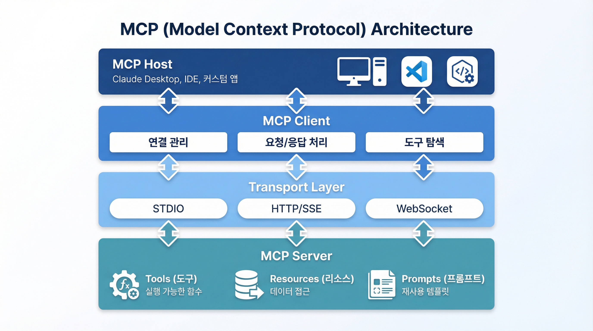

# Part 5: Model Context Protocol (MCP)

> 표준화된 AI 도구 통합 프로토콜

**학습 기간:** 3주
**난이도:** 고급
**사전 요구사항:** Part 1, 2, 3, 4 완료

---

## 들어가며

Part 3에서 우리는 Function Calling을 배웠습니다. AI가 외부 함수를 호출하여 실제 작업을 수행하는 강력한 기능이었죠. 하지만 문제가 있습니다. 각 애플리케이션마다 도구를 따로 구현해야 합니다.

**MCP(Model Context Protocol)**는 이 문제를 해결합니다. Anthropic이 개발한 이 오픈 프로토콜은 AI와 외부 도구 사이의 **표준화된 인터페이스**를 제공합니다. 한 번 MCP 서버를 만들면, 어떤 MCP 클라이언트에서든 그 도구를 사용할 수 있습니다.

마치 **USB**와 같습니다. USB 표준 덕분에 어떤 제조사의 기기든 어떤 컴퓨터에든 연결할 수 있듯이, MCP 덕분에 어떤 AI 도구든 어떤 AI 애플리케이션에서든 사용할 수 있습니다.


---

## Module 5.1: MCP 개요와 아키텍처

### 5.1.1 MCP란?

#### 정의

- **Model Context Protocol**: Anthropic이 개발한 오픈 프로토콜
- AI 모델과 외부 도구/데이터 소스 간의 **표준화된 통신 규격**
- "AI를 위한 USB" - 플러그앤플레이 도구 통합

#### 왜 MCP가 필요할까요?

| 기존 방식 | MCP 방식 |
|----------|---------|
| 각 도구마다 개별 구현 | 표준화된 인터페이스 |
| 강한 결합 (tight coupling) | 느슨한 결합 (loose coupling) |
| 재사용 어려움 | 높은 재사용성 |
| 보안 모델 불일치 | 일관된 보안 모델 |

### 5.1.2 아키텍처 개요

MCP 아키텍처는 네 개의 주요 레이어로 구성됩니다:



| 레이어 | 역할 | 구성 요소 |
|--------|------|----------|
| **MCP Host** | AI 애플리케이션 호스트 | Claude Desktop, IDE, 커스텀 앱 |
| **MCP Client** | 서버 연결 및 통신 관리 | 연결 관리, 요청/응답 처리, 도구 탐색 |
| **Transport** | 통신 프로토콜 추상화 | STDIO, HTTP/SSE, WebSocket |
| **MCP Server** | 도구와 리소스 제공 | Tools, Resources, Prompts |

> **핵심 포인트**: 각 레이어는 독립적으로 교체 가능하며, Transport 레이어 덕분에 동일한 서버 로직을 다양한 환경에서 재사용할 수 있습니다.

### 5.1.3 핵심 개념

#### Tools (도구)

**Tools**는 AI가 호출할 수 있는 **함수 또는 액션**입니다.

```kotlin
// 도구의 예시
- 날씨 조회: 도시 이름을 받아 현재 날씨 반환
- 데이터베이스 쿼리: SQL을 받아 결과 반환
- 파일 생성: 경로와 내용을 받아 파일 생성
- 이메일 전송: 수신자, 제목, 본문을 받아 이메일 발송
```

각 도구는 다음을 정의합니다:
- **이름**: 고유한 식별자
- **설명**: AI가 이해할 수 있는 도구의 목적
- **입력 스키마**: 필요한 파라미터와 타입
- **출력**: 반환되는 결과

#### Resources (리소스)

**Resources**는 AI가 접근할 수 있는 **데이터**입니다. URI 형식으로 식별됩니다.

```kotlin
// 리소스의 예시
- file:///docs/readme.md      → 파일 내용
- db://users/profile/123      → 사용자 프로필
- config://app/settings       → 앱 설정
- weather://alerts/seoul      → 날씨 경보
```

#### Prompts (프롬프트)

**Prompts**는 서버가 제공하는 **재사용 가능한 프롬프트 템플릿**입니다.

```kotlin
// 프롬프트의 예시
- code-review: 코드 리뷰를 위한 최적화된 프롬프트
- translate: 번역 작업을 위한 프롬프트
- summarize: 요약 작업을 위한 프롬프트
```

### 5.1.4 Transport 레이어

MCP는 다양한 전송 방식을 지원합니다.

#### STDIO Transport

표준 입출력을 사용하는 가장 간단한 방식입니다.

```
[Client Process] ←── stdin/stdout ──→ [Server Process]
```

- **장점**: 단순함, 프로세스 격리
- **사용 사례**: Claude Desktop, 로컬 도구
- **단점**: 원격 연결 불가

#### HTTP/SSE Transport

HTTP 요청과 Server-Sent Events를 조합한 방식입니다.

```
[Client] ──── HTTP POST (요청) ────→ [Server]
[Client] ←──── SSE (응답/이벤트) ───── [Server]
```

- **장점**: 웹 표준, 원격 연결 가능
- **사용 사례**: 웹 애플리케이션, 클라우드 서비스
- **단점**: 단방향 스트리밍만 가능

#### WebSocket Transport

양방향 실시간 통신을 위한 방식입니다.

- **장점**: 양방향 실시간 통신, 효율적
- **사용 사례**: 실시간 협업 도구
- **단점**: 구현 복잡성

### 5.1.5 메시지 형식

MCP는 **JSON-RPC 2.0**을 기반으로 합니다.

```json
// 요청 (Request)
{
  "jsonrpc": "2.0",
  "id": 1,
  "method": "tools/call",
  "params": {
    "name": "get_weather",
    "arguments": {
      "location": "Seoul"
    }
  }
}

// 응답 (Response)
{
  "jsonrpc": "2.0",
  "id": 1,
  "result": {
    "content": [
      {
        "type": "text",
        "text": "Seoul: 5°C, Cloudy"
      }
    ]
  }
}
```

---

## Module 5.2: MCP Server 구축 - WebMVC

### 5.2.1 프로젝트 설정

Spring AI는 MCP 서버를 쉽게 구축할 수 있는 스타터를 제공합니다.

#### Gradle 의존성 (Kotlin DSL)

```kotlin
dependencies {
    implementation("org.springframework.ai:spring-ai-mcp-server-webmvc-spring-boot-starter")
}
```

#### application.yml

```yaml
spring:
  ai:
    mcp:
      server:
        name: weather-server
        version: 1.0.0
        sse-message-endpoint: /mcp/message
        sse-endpoint: /mcp/sse
```

### 5.2.2 Tool 정의

#### 기본 Tool 구현

Kotlin으로 MCP Tool을 구현해 봅시다.

```kotlin
// 요청 데이터 클래스
data class WeatherRequest(
    @JsonProperty(required = true)
    @JsonPropertyDescription("도시 이름, 예: 'Seoul', 'Tokyo'")
    val location: String,

    @JsonPropertyDescription("온도 단위: 'celsius' 또는 'fahrenheit'")
    val unit: String = "celsius"
)

// 응답 데이터 클래스
data class WeatherResponse(
    val location: String,
    val temperature: Double,
    val unit: String,
    val condition: String,
    val humidity: Int
)

// Tool 설정
@Configuration
class WeatherToolConfig {

    @Bean
    fun getWeatherTool(weatherService: WeatherService): ToolCallback {
        return FunctionToolCallback.builder(
            "get_weather",
            weatherService::getWeather
        )
            .description("특정 위치의 현재 날씨를 조회합니다")
            .inputType(WeatherRequest::class.java)
            .build()
    }
}
```

#### 서비스 구현

```kotlin
@Service
class WeatherService(
    private val restTemplate: RestTemplate,
    @Value("\${weather.api.key}") private val apiKey: String
) {

    fun getWeather(request: WeatherRequest): WeatherResponse {
        val units = if (request.unit == "fahrenheit") "imperial" else "metric"

        val url = "https://api.openweathermap.org/data/2.5/weather" +
            "?q=${request.location}" +
            "&appid=$apiKey" +
            "&units=$units"

        val response = restTemplate.getForObject(url, OpenWeatherResponse::class.java)!!

        return WeatherResponse(
            location = request.location,
            temperature = response.main.temp,
            unit = request.unit,
            condition = response.weather.first().description,
            humidity = response.main.humidity
        )
    }
}

// OpenWeatherMap API 응답 구조
data class OpenWeatherResponse(
    val main: MainData,
    val weather: List<WeatherData>
)

data class MainData(
    val temp: Double,
    val humidity: Int
)

data class WeatherData(
    val description: String
)
```

#### 복수 Tool 등록

여러 도구를 한 번에 등록할 수 있습니다.

```kotlin
@Configuration
class ToolsConfig {

    @Bean
    fun mcpTools(
        weatherService: WeatherService,
        geocodingService: GeocodingService
    ): List<ToolCallback> = listOf(
        FunctionToolCallback.builder("get_weather", weatherService::getWeather)
            .description("현재 날씨를 조회합니다")
            .inputType(WeatherRequest::class.java)
            .build(),

        FunctionToolCallback.builder("get_forecast", weatherService::getForecast)
            .description("5일간의 날씨 예보를 조회합니다")
            .inputType(ForecastRequest::class.java)
            .build(),

        FunctionToolCallback.builder("geocode", geocodingService::geocode)
            .description("주소를 좌표로 변환합니다")
            .inputType(GeocodeRequest::class.java)
            .build()
    )
}
```

### 5.2.3 Resource 정의

Resource는 AI가 읽을 수 있는 데이터를 제공합니다.

```kotlin
@Configuration
class ResourceConfig {

    @Bean
    fun weatherAlertsResource(): McpResource {
        return McpResource.builder()
            .uri("weather://alerts/active")
            .name("활성 날씨 경보")
            .description("현재 활성화된 날씨 경보 목록")
            .mimeType("application/json")
            .build()
    }

    @Bean
    fun weatherResourceProvider(
        weatherService: WeatherService
    ): ResourceProvider = object : ResourceProvider {

        override fun getResource(uri: String): McpResource? {
            if (uri.startsWith("weather://alerts/")) {
                val region = uri.removePrefix("weather://alerts/")
                return createAlertResource(region)
            }
            return null
        }

        override fun listResources(): List<McpResource> {
            return listOf(weatherAlertsResource())
        }

        private fun createAlertResource(region: String): McpResource {
            val alerts = weatherService.getAlerts(region)
            return McpResource.builder()
                .uri("weather://alerts/$region")
                .name("$region 지역 날씨 경보")
                .description("$region 지역의 활성 날씨 경보")
                .mimeType("application/json")
                .build()
        }
    }
}
```

### 5.2.4 에러 처리

MCP 에러를 적절히 처리하는 것이 중요합니다.

```kotlin
data class McpError(
    val code: Int,
    val message: String,
    val data: Map<String, Any>? = null
)

@ControllerAdvice
class McpErrorHandler {

    private val logger = LoggerFactory.getLogger(javaClass)

    @ExceptionHandler(McpException::class)
    fun handleMcpError(e: McpException): ResponseEntity<McpError> {
        logger.warn("MCP Error: ${e.message}")

        val error = McpError(
            code = e.code,
            message = e.message ?: "Unknown error",
            data = e.data
        )
        return ResponseEntity.badRequest().body(error)
    }

    @ExceptionHandler(Exception::class)
    fun handleGenericError(e: Exception): ResponseEntity<McpError> {
        logger.error("Unexpected error", e)

        val error = McpError(
            code = -32603,  // Internal error (JSON-RPC 표준)
            message = "Internal server error",
            data = mapOf("detail" to (e.message ?: "Unknown"))
        )
        return ResponseEntity.internalServerError().body(error)
    }
}
```

### 5.2.5 실습: 완전한 날씨 MCP 서버

```kotlin
@SpringBootApplication
class WeatherMcpServerApplication

fun main(args: Array<String>) {
    runApplication<WeatherMcpServerApplication>(*args)
}

// application.yml
/*
spring:
  ai:
    mcp:
      server:
        name: weather-mcp-server
        version: 1.0.0

weather:
  api:
    key: ${OPENWEATHER_API_KEY}
*/

@Service
class WeatherService(
    private val webClient: WebClient,
    @Value("\${weather.api.key}") private val apiKey: String
) {

    fun getWeather(request: WeatherRequest): WeatherResponse {
        val units = if (request.unit == "fahrenheit") "imperial" else "metric"

        return webClient.get()
            .uri { uriBuilder ->
                uriBuilder
                    .scheme("https")
                    .host("api.openweathermap.org")
                    .path("/data/2.5/weather")
                    .queryParam("q", request.location)
                    .queryParam("appid", apiKey)
                    .queryParam("units", units)
                    .build()
            }
            .retrieve()
            .bodyToMono(OpenWeatherResponse::class.java)
            .map { response ->
                WeatherResponse(
                    location = request.location,
                    temperature = response.main.temp,
                    unit = request.unit,
                    condition = response.weather.first().description,
                    humidity = response.main.humidity
                )
            }
            .block()!!
    }

    fun getForecast(request: ForecastRequest): ForecastResponse {
        val count = request.days.coerceIn(1, 5) * 8  // 3시간 간격

        return webClient.get()
            .uri { uriBuilder ->
                uriBuilder
                    .scheme("https")
                    .host("api.openweathermap.org")
                    .path("/data/2.5/forecast")
                    .queryParam("q", request.location)
                    .queryParam("appid", apiKey)
                    .queryParam("units", "metric")
                    .queryParam("cnt", count)
                    .build()
            }
            .retrieve()
            .bodyToMono(OpenWeatherForecastResponse::class.java)
            .map { it.toForecastResponse() }
            .block()!!
    }
}
```

---

## Module 5.3: MCP Server 구축 - WebFlux

### 5.3.1 Reactive MCP 서버

WebFlux를 사용하면 비동기/논블로킹 MCP 서버를 구축할 수 있습니다.

#### Gradle 의존성

```kotlin
dependencies {
    implementation("org.springframework.ai:spring-ai-mcp-server-webflux-spring-boot-starter")
}
```

#### Reactive Service 구현

```kotlin
@Service
class ReactiveWeatherService(
    private val webClient: WebClient,
    @Value("\${weather.api.key}") private val apiKey: String
) {

    fun getWeather(request: WeatherRequest): Mono<WeatherResponse> {
        return webClient.get()
            .uri { uriBuilder ->
                uriBuilder
                    .path("/data/2.5/weather")
                    .queryParam("q", request.location)
                    .queryParam("appid", apiKey)
                    .queryParam("units", "metric")
                    .build()
            }
            .retrieve()
            .bodyToMono(OpenWeatherResponse::class.java)
            .map { response ->
                WeatherResponse(
                    location = request.location,
                    temperature = response.main.temp,
                    unit = request.unit,
                    condition = response.weather.first().description,
                    humidity = response.main.humidity
                )
            }
            .timeout(Duration.ofSeconds(10))
            .onErrorResume { e ->
                Mono.just(
                    WeatherResponse(
                        location = request.location,
                        temperature = 0.0,
                        unit = request.unit,
                        condition = "Error: ${e.message}",
                        humidity = 0
                    )
                )
            }
    }

    // 여러 도시의 날씨를 동시에 조회
    fun getWeatherBatch(locations: List<String>): Flux<WeatherResponse> {
        return Flux.fromIterable(locations)
            .flatMap(
                { location ->
                    getWeather(WeatherRequest(location))
                },
                5  // 최대 동시성
            )
    }
}
```

#### Reactive Tool 설정

```kotlin
@Configuration
class ReactiveToolConfig {

    @Bean
    fun asyncWeatherTool(
        weatherService: ReactiveWeatherService
    ): ToolCallback {
        return FunctionToolCallback.builder(
            "get_weather_async",
            { request: WeatherRequest ->
                weatherService.getWeather(request).block()
            }
        )
            .description("비동기로 날씨를 조회합니다")
            .inputType(WeatherRequest::class.java)
            .build()
    }

    @Bean
    fun batchWeatherTool(
        weatherService: ReactiveWeatherService
    ): ToolCallback {
        return FunctionToolCallback.builder(
            "get_weather_batch",
            { request: BatchWeatherRequest ->
                weatherService.getWeatherBatch(request.locations)
                    .collectList()
                    .block()
            }
        )
            .description("여러 도시의 날씨를 동시에 조회합니다")
            .inputType(BatchWeatherRequest::class.java)
            .build()
    }
}

data class BatchWeatherRequest(
    val locations: List<String>
)
```

---

## Module 5.4: MCP Server 구축 - STDIO

### 5.4.1 STDIO 서버 설정

STDIO 방식은 **Claude Desktop**과 같은 데스크톱 애플리케이션과 연동할 때 유용합니다.

#### Gradle 의존성

```kotlin
dependencies {
    implementation("org.springframework.ai:spring-ai-mcp-server-stdio-spring-boot-starter")
}
```

#### application.yml

```yaml
spring:
  main:
    web-application-type: none  # 웹 서버 비활성화
  ai:
    mcp:
      server:
        stdio: true
        name: local-tools-server
```

### 5.4.2 Claude Desktop 연동

Claude Desktop의 설정 파일에 MCP 서버를 등록합니다.

#### macOS: `~/Library/Application Support/Claude/claude_desktop_config.json`

```json
{
  "mcpServers": {
    "weather": {
      "command": "java",
      "args": [
        "-jar",
        "/path/to/weather-mcp-server.jar"
      ],
      "env": {
        "WEATHER_API_KEY": "your-api-key"
      }
    }
  }
}
```

#### Windows: `%APPDATA%\Claude\claude_desktop_config.json`

```json
{
  "mcpServers": {
    "weather": {
      "command": "java",
      "args": [
        "-jar",
        "C:\\path\\to\\weather-mcp-server.jar"
      ],
      "env": {
        "WEATHER_API_KEY": "your-api-key"
      }
    }
  }
}
```

### 5.4.3 실습: 파일 시스템 MCP 서버

로컬 파일 시스템에 접근할 수 있는 MCP 서버를 만들어 봅시다.

```kotlin
@SpringBootApplication
class FilesystemMcpServer

fun main(args: Array<String>) {
    runApplication<FilesystemMcpServer>(*args)
}

// 요청/응답 데이터 클래스
data class ReadFileRequest(
    @JsonPropertyDescription("읽을 파일의 절대 경로")
    val path: String
)

data class WriteFileRequest(
    @JsonPropertyDescription("쓸 파일의 절대 경로")
    val path: String,

    @JsonPropertyDescription("파일에 쓸 내용")
    val content: String
)

data class ListDirRequest(
    @JsonPropertyDescription("디렉토리 경로")
    val path: String
)

data class FileContent(
    val path: String,
    val content: String?,
    val success: Boolean,
    val error: String? = null
)

data class DirectoryListing(
    val path: String,
    val entries: List<FileEntry>,
    val success: Boolean,
    val error: String? = null
)

data class FileEntry(
    val name: String,
    val isDirectory: Boolean,
    val size: Long,
    val lastModified: String
)

@Configuration
class FilesystemToolConfig(
    @Value("\${mcp.filesystem.allowed-paths}")
    private val allowedPaths: List<String>
) {

    private val logger = LoggerFactory.getLogger(javaClass)

    @Bean
    fun filesystemTools(): List<ToolCallback> = listOf(
        FunctionToolCallback.builder("read_file", ::readFile)
            .description("파일의 내용을 읽습니다")
            .inputType(ReadFileRequest::class.java)
            .build(),

        FunctionToolCallback.builder("write_file", ::writeFile)
            .description("파일에 내용을 씁니다")
            .inputType(WriteFileRequest::class.java)
            .build(),

        FunctionToolCallback.builder("list_directory", ::listDirectory)
            .description("디렉토리의 내용을 나열합니다")
            .inputType(ListDirRequest::class.java)
            .build()
    )

    private fun readFile(request: ReadFileRequest): FileContent {
        validatePath(request.path)

        return try {
            val content = Files.readString(Path.of(request.path))
            FileContent(request.path, content, true)
        } catch (e: IOException) {
            logger.error("파일 읽기 실패: ${request.path}", e)
            FileContent(request.path, null, false, e.message)
        }
    }

    private fun writeFile(request: WriteFileRequest): FileContent {
        validatePath(request.path)

        return try {
            Files.writeString(Path.of(request.path), request.content)
            FileContent(request.path, null, true)
        } catch (e: IOException) {
            logger.error("파일 쓰기 실패: ${request.path}", e)
            FileContent(request.path, null, false, e.message)
        }
    }

    private fun listDirectory(request: ListDirRequest): DirectoryListing {
        validatePath(request.path)

        return try {
            val entries = Files.list(Path.of(request.path))
                .map { path ->
                    val attrs = Files.readAttributes(path, BasicFileAttributes::class.java)
                    FileEntry(
                        name = path.fileName.toString(),
                        isDirectory = attrs.isDirectory,
                        size = attrs.size(),
                        lastModified = attrs.lastModifiedTime().toString()
                    )
                }
                .toList()

            DirectoryListing(request.path, entries, true)
        } catch (e: IOException) {
            logger.error("디렉토리 읽기 실패: ${request.path}", e)
            DirectoryListing(request.path, emptyList(), false, e.message)
        }
    }

    private fun validatePath(path: String) {
        val normalizedPath = Path.of(path).normalize().toAbsolutePath()
        val isAllowed = allowedPaths.any { allowedPath ->
            normalizedPath.startsWith(Path.of(allowedPath).normalize().toAbsolutePath())
        }

        if (!isAllowed) {
            throw SecurityException("허용되지 않은 경로입니다: $path")
        }
    }
}
```

#### application.yml

```yaml
spring:
  main:
    web-application-type: none
  ai:
    mcp:
      server:
        stdio: true
        name: filesystem-server

mcp:
  filesystem:
    allowed-paths:
      - /Users/username/Documents
      - /Users/username/Projects
```

> **보안 주의**: 파일 시스템 접근은 보안에 민감합니다. 반드시 `allowed-paths`를 설정하여 접근 가능한 경로를 제한하세요.

---

## Module 5.5: MCP Client 구현

### 5.5.1 Client 설정

이제 MCP 서버에 연결하는 **클라이언트**를 만들어 봅시다.

#### Gradle 의존성

```kotlin
dependencies {
    implementation("org.springframework.ai:spring-ai-mcp-client-spring-boot-starter")
}
```

#### application.yml (SSE 방식)

```yaml
spring:
  ai:
    mcp:
      client:
        transport: sse
        sse:
          url: http://localhost:8080/mcp/sse
```

#### application.yml (STDIO 방식)

```yaml
spring:
  ai:
    mcp:
      client:
        transport: stdio
        stdio:
          command: java
          args: -jar,/path/to/server.jar
```

### 5.5.2 도구 사용

```kotlin
@Service
class McpClientService(
    private val mcpClient: McpSyncClient,
    private val chatClient: ChatClient
) {

    fun chatWithTools(message: String): String {
        // 1. MCP 서버의 도구 목록 가져오기
        val tools = mcpClient.listTools().map { tool ->
            toToolCallback(tool)
        }

        // 2. ChatClient에 도구 연결
        return chatClient.prompt()
            .user(message)
            .functions(tools)
            .call()
            .content()
    }

    // MCP Tool을 Spring AI ToolCallback으로 변환
    private fun toToolCallback(tool: McpTool): ToolCallback {
        return McpToolCallback(mcpClient, tool)
    }

    // 도구 직접 호출
    fun callTool(toolName: String, arguments: Map<String, Any>): ToolResult {
        return mcpClient.callTool(toolName, arguments)
    }

    // 사용 가능한 도구 목록 확인
    fun listAvailableTools(): List<String> {
        return mcpClient.listTools().map { it.name }
    }
}
```

### 5.5.3 다중 서버 연결

여러 MCP 서버에 동시에 연결하여 다양한 도구를 활용할 수 있습니다.

```kotlin
@ConfigurationProperties(prefix = "mcp.servers")
data class McpServersProperties(
    val servers: Map<String, McpServerConfig> = emptyMap()
)

data class McpServerConfig(
    val type: String,  // "sse" or "stdio"
    val url: String? = null,
    val command: String? = null,
    val args: List<String> = emptyList()
)

@Configuration
@EnableConfigurationProperties(McpServersProperties::class)
class MultiServerConfig {

    @Bean
    fun mcpClients(properties: McpServersProperties): Map<String, McpSyncClient> {
        return properties.servers.mapValues { (name, config) ->
            createClient(name, config)
        }
    }

    private fun createClient(name: String, config: McpServerConfig): McpSyncClient {
        return when (config.type) {
            "sse" -> {
                McpSyncClient.builder()
                    .transport(SseClientTransport(config.url!!))
                    .build()
            }
            "stdio" -> {
                McpSyncClient.builder()
                    .transport(StdioClientTransport(config.command!!, config.args))
                    .build()
            }
            else -> throw IllegalArgumentException("Unknown transport type: ${config.type}")
        }
    }
}

// 집계된 도구 제공자
@Service
class AggregatedToolProvider(
    private val clients: Map<String, McpSyncClient>
) {
    private val toolToServer = ConcurrentHashMap<String, String>()

    fun getAllTools(): List<ToolCallback> {
        val allTools = mutableListOf<ToolCallback>()

        clients.forEach { (serverName, client) ->
            client.listTools().forEach { tool ->
                toolToServer[tool.name] = serverName
                allTools.add(McpToolCallback(client, tool))
            }
        }

        return allTools
    }

    fun callTool(toolName: String, args: Map<String, Any>): ToolResult {
        val serverName = toolToServer[toolName]
            ?: throw IllegalArgumentException("Unknown tool: $toolName")

        val client = clients[serverName]
            ?: throw IllegalStateException("Server not found: $serverName")

        return client.callTool(toolName, args)
    }

    fun getToolsByServer(serverName: String): List<String> {
        return toolToServer.filterValues { it == serverName }.keys.toList()
    }
}
```

#### application.yml

```yaml
mcp:
  servers:
    servers:
      weather:
        type: sse
        url: http://localhost:8081/mcp/sse
      database:
        type: sse
        url: http://localhost:8082/mcp/sse
      filesystem:
        type: stdio
        command: java
        args:
          - -jar
          - /path/to/filesystem-server.jar
```

---

## Module 5.6: MCP Annotations 기반 개발

### 5.6.1 어노테이션 기반 Tool

Spring AI는 어노테이션을 사용한 간편한 MCP 개발을 지원합니다.

```kotlin
@McpServer
@Component
class AnnotatedWeatherServer(
    private val weatherService: WeatherService
) {

    @McpTool(description = "현재 날씨를 조회합니다")
    fun getWeather(
        @McpParam(description = "도시 이름")
        location: String,

        @McpParam(description = "온도 단위: celsius 또는 fahrenheit", required = false)
        unit: String?
    ): WeatherResponse {
        return weatherService.getWeather(
            location,
            unit ?: "celsius"
        )
    }

    @McpTool(description = "날씨 예보를 조회합니다")
    fun getForecast(
        @McpParam(description = "도시 이름")
        location: String,

        @McpParam(description = "예보 일수 (1-7)")
        days: Int
    ): ForecastResponse {
        return weatherService.getForecast(
            location,
            days.coerceIn(1, 7)
        )
    }
}
```

### 5.6.2 어노테이션 기반 Resource

```kotlin
@McpServer
@Component
class AnnotatedResourceServer(
    private val configService: ConfigService,
    private val userService: UserService
) {

    @McpResource(
        uri = "config://app/settings",
        name = "애플리케이션 설정",
        description = "현재 애플리케이션 설정 정보"
    )
    fun getAppSettings(): String {
        return configService.getSettings().toJson()
    }

    @McpResourceTemplate(
        uriTemplate = "user://{userId}/profile",
        name = "사용자 프로필",
        description = "ID로 사용자 프로필 조회"
    )
    fun getUserProfile(
        @McpParam("userId") userId: String
    ): String {
        return userService.getProfile(userId).toJson()
    }
}
```

### 5.6.3 실습: 비즈니스 도구 서버

```kotlin
@McpServer
@Component
class BusinessToolsServer(
    private val customerRepository: CustomerRepository,
    private val orderRepository: OrderRepository,
    private val ticketService: TicketService
) {

    @McpTool(description = "이름 또는 이메일로 고객을 검색합니다")
    fun searchCustomers(
        @McpParam(description = "검색어")
        query: String,

        @McpParam(description = "최대 결과 수", required = false)
        limit: Int?
    ): List<CustomerSummary> {
        return customerRepository.search(query, limit ?: 10)
            .map { CustomerSummary.from(it) }
    }

    @McpTool(description = "고객의 주문 내역을 조회합니다")
    fun getOrderHistory(
        @McpParam(description = "고객 ID")
        customerId: String,

        @McpParam(description = "취소된 주문 포함 여부", required = false)
        includeCancelled: Boolean?
    ): OrderHistory {
        val orders = orderRepository.findByCustomerId(
            customerId,
            includeCancelled ?: false
        )
        return OrderHistory.from(orders)
    }

    @McpTool(description = "지원 티켓을 생성합니다")
    fun createTicket(
        @McpParam(description = "고객 ID")
        customerId: String,

        @McpParam(description = "이슈 카테고리")
        category: String,

        @McpParam(description = "이슈 설명")
        description: String,

        @McpParam(description = "우선순위: LOW, MEDIUM, HIGH", required = false)
        priority: String?
    ): TicketResult {
        val ticket = ticketService.create(
            customerId = customerId,
            category = category,
            description = description,
            priority = priority?.let { Priority.valueOf(it) } ?: Priority.MEDIUM
        )
        return TicketResult.success(ticket.id)
    }

    @McpResource(
        uri = "stats://daily/summary",
        name = "일일 통계",
        description = "오늘의 주문 및 고객 통계"
    )
    fun getDailySummary(): String {
        val summary = DailySummary(
            newCustomers = customerRepository.countTodayNew(),
            totalOrders = orderRepository.countToday(),
            totalRevenue = orderRepository.sumTodayRevenue(),
            openTickets = ticketService.countOpen()
        )
        return summary.toJson()
    }
}

data class CustomerSummary(
    val id: String,
    val name: String,
    val email: String,
    val totalOrders: Int
) {
    companion object {
        fun from(customer: Customer) = CustomerSummary(
            id = customer.id,
            name = customer.name,
            email = customer.email,
            totalOrders = customer.orderCount
        )
    }
}

data class OrderHistory(
    val customerId: String,
    val orders: List<OrderSummary>,
    val totalSpent: Double
) {
    companion object {
        fun from(orders: List<Order>) = OrderHistory(
            customerId = orders.firstOrNull()?.customerId ?: "",
            orders = orders.map { OrderSummary.from(it) },
            totalSpent = orders.sumOf { it.total }
        )
    }
}
```

---

## Module 5.7: MCP Sampling

### 5.7.1 Sampling 개념

**Sampling**은 MCP의 고급 기능으로, **서버가 클라이언트의 LLM 기능을 활용**할 수 있게 합니다.

```
서버 → 클라이언트: "이 텍스트를 시로 바꿔줘"
클라이언트 → LLM: "이 텍스트를 시로 바꿔줘"
LLM → 클라이언트: "시 결과..."
클라이언트 → 서버: "시 결과..."
```

이를 통해 하나의 도구 호출 안에서 **다중 모델 오케스트레이션**이 가능해집니다.

### 5.7.2 서버 측 Sampling

```kotlin
@McpServer
@Component
class SamplingWeatherServer(
    private val weatherService: WeatherService
) {

    @McpTool(description = "창작 날씨 설명과 함께 날씨를 조회합니다")
    fun getCreativeWeather(
        @McpParam(description = "위치")
        location: String,
        toolContext: ToolContext
    ): CreativeWeatherResponse {
        // 1. 날씨 데이터 가져오기
        val weather = weatherService.getWeather(location)

        // 2. MCP Sampling으로 창작 설명 요청
        var poem: String? = null
        var analysis: String? = null

        McpToolUtils.getMcpExchange(toolContext).ifPresent { exchange ->
            val capabilities = exchange.clientCapabilities

            if (capabilities.sampling != null) {
                // OpenAI에 시 요청
                val poemRequest = CreateMessageRequest.builder()
                    .systemPrompt("당신은 시인입니다")
                    .messages(listOf(
                        SamplingMessage(
                            Role.USER,
                            TextContent("이 날씨에 대한 하이쿠를 써주세요: $weather")
                        )
                    ))
                    .modelPreferences(
                        ModelPreferences.builder()
                            .addHint("openai")
                            .build()
                    )
                    .build()

                val poemResult = exchange.createMessage(poemRequest)
                poem = (poemResult.content as TextContent).text

                // Anthropic에 분석 요청
                val analysisRequest = CreateMessageRequest.builder()
                    .systemPrompt("당신은 기상 분석가입니다")
                    .messages(listOf(
                        SamplingMessage(
                            Role.USER,
                            TextContent("이 날씨를 분석해주세요: $weather")
                        )
                    ))
                    .modelPreferences(
                        ModelPreferences.builder()
                            .addHint("anthropic")
                            .build()
                    )
                    .build()

                val analysisResult = exchange.createMessage(analysisRequest)
                analysis = (analysisResult.content as TextContent).text
            }
        }

        return CreativeWeatherResponse(
            weather = weather,
            poem = poem,
            analysis = analysis
        )
    }
}

data class CreativeWeatherResponse(
    val weather: WeatherResponse,
    val poem: String?,
    val analysis: String?
)
```

### 5.7.3 클라이언트 측 Sampling 핸들러

클라이언트는 서버의 Sampling 요청을 처리해야 합니다.

```kotlin
@Configuration
class SamplingConfig {

    @Bean
    fun samplingCustomizer(
        @Qualifier("openaiChatClient") openai: ChatClient,
        @Qualifier("anthropicChatClient") anthropic: ChatClient
    ): McpSyncClientCustomizer {
        return McpSyncClientCustomizer { name, spec ->
            spec.sampling { request ->
                // 모델 힌트 확인
                val modelHint = request.modelPreferences()
                    .hints
                    .firstOrNull()
                    ?.name
                    ?: "openai"

                // 적절한 ChatClient 선택
                val chatClient = if (modelHint.contains("anthropic")) {
                    anthropic
                } else {
                    openai
                }

                // 프롬프트 추출
                val userPrompt = (request.messages.first().content as TextContent).text

                // LLM 호출
                val response = chatClient.prompt()
                    .system(request.systemPrompt ?: "")
                    .user(userPrompt)
                    .call()
                    .content()

                CreateMessageResult.builder()
                    .content(TextContent(response))
                    .build()
            }
        }
    }
}
```

---

## Module 5.8: Dynamic Tool Update

### 5.8.1 동적 도구 등록

운영 중인 서버에서 도구를 동적으로 추가하거나 제거할 수 있습니다.

```kotlin
@Service
class DynamicToolManager(
    private val mcpServer: McpServer
) {
    private val dynamicTools = ConcurrentHashMap<String, ToolCallback>()
    private val logger = LoggerFactory.getLogger(javaClass)

    fun registerTool(name: String, tool: ToolCallback) {
        dynamicTools[name] = tool
        mcpServer.notifyToolsChanged()
        logger.info("도구 등록됨: $name")
    }

    fun unregisterTool(name: String) {
        dynamicTools.remove(name)
        mcpServer.notifyToolsChanged()
        logger.info("도구 제거됨: $name")
    }

    fun listTools(): List<String> = dynamicTools.keys.toList()

    @Bean
    fun dynamicToolProvider(): ToolProvider {
        return ToolProvider { ArrayList(dynamicTools.values) }
    }
}

// REST API로 동적 등록
@RestController
@RequestMapping("/api/tools")
class ToolManagementController(
    private val toolManager: DynamicToolManager
) {

    @PostMapping
    fun registerTool(@RequestBody definition: ToolDefinition): ResponseEntity<Void> {
        val tool = createToolFromDefinition(definition)
        toolManager.registerTool(definition.name, tool)
        return ResponseEntity.ok().build()
    }

    @DeleteMapping("/{name}")
    fun unregisterTool(@PathVariable name: String): ResponseEntity<Void> {
        toolManager.unregisterTool(name)
        return ResponseEntity.ok().build()
    }

    @GetMapping
    fun listTools(): List<String> {
        return toolManager.listTools()
    }

    private fun createToolFromDefinition(definition: ToolDefinition): ToolCallback {
        // 동적 도구 생성 로직
        return FunctionToolCallback.builder(
            definition.name,
            definition.handler
        )
            .description(definition.description)
            .build()
    }
}

data class ToolDefinition(
    val name: String,
    val description: String,
    val handler: (Map<String, Any>) -> Any
)
```

### 5.8.2 클라이언트 캐시 갱신

도구 변경 알림을 받아 클라이언트의 캐시를 갱신합니다.

```kotlin
@Component
class ToolChangeListener(
    private val mcpClient: McpAsyncClient,
    private val localRegistry: ToolRegistry
) {
    private val logger = LoggerFactory.getLogger(javaClass)

    @PostConstruct
    fun subscribe() {
        mcpClient.onToolsChanged { notification ->
            // 도구 목록 새로고침
            mcpClient.listTools()
                .subscribe { tools ->
                    localRegistry.updateTools(tools)
                    logger.info("도구 목록 갱신됨: ${tools.size}개")
                }
        }
    }
}

@Component
class ToolRegistry {
    private val tools = ConcurrentHashMap<String, McpTool>()

    fun updateTools(newTools: List<McpTool>) {
        tools.clear()
        newTools.forEach { tools[it.name] = it }
    }

    fun getTool(name: String): McpTool? = tools[name]

    fun getAllTools(): List<McpTool> = tools.values.toList()
}
```

---

## Module 5.9: 실전 MCP 통합

### 5.9.1 SQLite 데이터베이스 서버

```kotlin
@McpServer
@Component
class SqliteMcpServer(
    private val jdbcTemplate: JdbcTemplate
) {
    private val logger = LoggerFactory.getLogger(javaClass)

    @McpTool(description = "읽기 전용 SQL 쿼리를 실행합니다")
    fun executeQuery(
        @McpParam(description = "SQL SELECT 쿼리")
        query: String
    ): QueryResult {
        // 읽기 전용 검증
        val trimmedQuery = query.trim().uppercase()
        if (!trimmedQuery.startsWith("SELECT")) {
            throw McpException(-32600, "SELECT 쿼리만 허용됩니다")
        }

        // 위험한 키워드 검사
        val dangerousKeywords = listOf("DROP", "DELETE", "UPDATE", "INSERT", "ALTER", "TRUNCATE")
        if (dangerousKeywords.any { trimmedQuery.contains(it) }) {
            throw McpException(-32600, "허용되지 않는 SQL 키워드가 포함되어 있습니다")
        }

        return try {
            val results = jdbcTemplate.queryForList(query)
            QueryResult(
                data = results,
                rowCount = results.size,
                success = true
            )
        } catch (e: Exception) {
            logger.error("쿼리 실행 실패: $query", e)
            QueryResult(
                data = emptyList(),
                rowCount = 0,
                success = false,
                error = e.message
            )
        }
    }

    @McpTool(description = "데이터베이스 스키마 정보를 조회합니다")
    fun getSchema(
        @McpParam(description = "테이블 이름 (선택)", required = false)
        tableName: String?
    ): SchemaInfo {
        return if (tableName != null) {
            getTableSchema(tableName)
        } else {
            getAllTablesSchema()
        }
    }

    @McpResource(
        uri = "db://schema",
        name = "데이터베이스 스키마",
        description = "전체 데이터베이스 스키마 문서"
    )
    fun getDatabaseSchema(): String {
        return generateSchemaDocumentation()
    }

    private fun getTableSchema(tableName: String): SchemaInfo {
        val columns = jdbcTemplate.queryForList(
            "PRAGMA table_info($tableName)"
        )

        return SchemaInfo(
            tables = listOf(
                TableInfo(
                    name = tableName,
                    columns = columns.map { col ->
                        ColumnInfo(
                            name = col["name"] as String,
                            type = col["type"] as String,
                            nullable = (col["notnull"] as Int) == 0,
                            primaryKey = (col["pk"] as Int) == 1
                        )
                    }
                )
            )
        )
    }

    private fun getAllTablesSchema(): SchemaInfo {
        val tables = jdbcTemplate.queryForList(
            "SELECT name FROM sqlite_master WHERE type='table' AND name NOT LIKE 'sqlite_%'"
        )

        return SchemaInfo(
            tables = tables.map { table ->
                getTableSchema(table["name"] as String).tables.first()
            }
        )
    }

    private fun generateSchemaDocumentation(): String {
        val schema = getAllTablesSchema()
        val sb = StringBuilder("# Database Schema\n\n")

        schema.tables.forEach { table ->
            sb.append("## ${table.name}\n\n")
            sb.append("| Column | Type | Nullable | Primary Key |\n")
            sb.append("|--------|------|----------|-------------|\n")

            table.columns.forEach { col ->
                sb.append("| ${col.name} | ${col.type} | ${col.nullable} | ${col.primaryKey} |\n")
            }
            sb.append("\n")
        }

        return sb.toString()
    }
}

data class QueryResult(
    val data: List<Map<String, Any>>,
    val rowCount: Int,
    val success: Boolean,
    val error: String? = null
)

data class SchemaInfo(
    val tables: List<TableInfo>
)

data class TableInfo(
    val name: String,
    val columns: List<ColumnInfo>
)

data class ColumnInfo(
    val name: String,
    val type: String,
    val nullable: Boolean,
    val primaryKey: Boolean
)
```

### 5.9.2 웹 검색 서버 (Brave)

```kotlin
@McpServer
@Component
class BraveSearchServer(
    private val webClient: WebClient,
    @Value("\${brave.api.key}") private val apiKey: String
) {

    @McpTool(description = "Brave 검색으로 웹을 검색합니다")
    fun webSearch(
        @McpParam(description = "검색 쿼리")
        query: String,

        @McpParam(description = "결과 수 (최대 20)", required = false)
        count: Int?
    ): SearchResults {
        return webClient.get()
            .uri { uriBuilder ->
                uriBuilder
                    .scheme("https")
                    .host("api.search.brave.com")
                    .path("/res/v1/web/search")
                    .queryParam("q", query)
                    .queryParam("count", (count ?: 10).coerceIn(1, 20))
                    .build()
            }
            .header("X-Subscription-Token", apiKey)
            .retrieve()
            .bodyToMono(BraveSearchResponse::class.java)
            .map { it.toSearchResults() }
            .block()!!
    }

    @McpTool(description = "웹페이지의 요약을 가져옵니다")
    fun summarizePage(
        @McpParam(description = "요약할 URL")
        url: String
    ): PageSummary {
        val content = fetchPageContent(url)
        return PageSummary(
            url = url,
            summary = content.take(500) + "..."  // 실제로는 AI 요약 사용
        )
    }

    private fun fetchPageContent(url: String): String {
        return webClient.get()
            .uri(url)
            .retrieve()
            .bodyToMono(String::class.java)
            .map { html ->
                // HTML에서 텍스트 추출 (실제로는 Jsoup 등 사용)
                html.replace(Regex("<[^>]+>"), " ")
                    .replace(Regex("\\s+"), " ")
                    .trim()
            }
            .block() ?: ""
    }
}

data class SearchResults(
    val query: String,
    val results: List<SearchResult>,
    val totalResults: Int
)

data class SearchResult(
    val title: String,
    val url: String,
    val description: String
)

data class PageSummary(
    val url: String,
    val summary: String
)

data class BraveSearchResponse(
    val web: WebResults?
) {
    fun toSearchResults(): SearchResults {
        return SearchResults(
            query = "",
            results = web?.results?.map { result ->
                SearchResult(
                    title = result.title,
                    url = result.url,
                    description = result.description
                )
            } ?: emptyList(),
            totalResults = web?.results?.size ?: 0
        )
    }
}

data class WebResults(
    val results: List<WebResult>
)

data class WebResult(
    val title: String,
    val url: String,
    val description: String
)
```

### 5.9.3 Docker 배포

#### Dockerfile

```dockerfile
FROM eclipse-temurin:17-jre-alpine

WORKDIR /app

COPY build/libs/mcp-server.jar app.jar

EXPOSE 8080

ENV JAVA_OPTS="-Xmx512m"

ENTRYPOINT ["sh", "-c", "java $JAVA_OPTS -jar app.jar"]
```

#### docker-compose.yml

```yaml
version: '3.8'

services:
  mcp-weather:
    build: ./weather-server
    ports:
      - "8081:8080"
    environment:
      - WEATHER_API_KEY=${WEATHER_API_KEY}
    healthcheck:
      test: ["CMD", "curl", "-f", "http://localhost:8080/actuator/health"]
      interval: 30s
      timeout: 10s
      retries: 3

  mcp-database:
    build: ./database-server
    ports:
      - "8082:8080"
    volumes:
      - ./data:/data
    environment:
      - DB_PATH=/data/app.db
    healthcheck:
      test: ["CMD", "curl", "-f", "http://localhost:8080/actuator/health"]
      interval: 30s
      timeout: 10s
      retries: 3

  mcp-search:
    build: ./search-server
    ports:
      - "8083:8080"
    environment:
      - BRAVE_API_KEY=${BRAVE_API_KEY}
    healthcheck:
      test: ["CMD", "curl", "-f", "http://localhost:8080/actuator/health"]
      interval: 30s
      timeout: 10s
      retries: 3

  mcp-gateway:
    build: ./gateway
    ports:
      - "8080:8080"
    depends_on:
      mcp-weather:
        condition: service_healthy
      mcp-database:
        condition: service_healthy
      mcp-search:
        condition: service_healthy
    environment:
      - MCP_SERVERS=weather:8081,database:8082,search:8083
```

### 5.9.4 실습: 기업용 데이터 분석 AI 비서

모든 것을 통합한 완전한 AI 비서를 만들어 봅시다.

```kotlin
data class UserContext(
    val name: String,
    val role: String,
    val department: String,
    val permissions: Set<String>
)

data class AssistantResponse(
    val content: String,
    val toolsUsed: List<ToolCallInfo>
)

data class ToolCallInfo(
    val toolName: String,
    val arguments: Map<String, Any>,
    val result: String
)

@Service
class EnterpriseAiAssistant(
    private val chatClient: ChatClient,
    private val mcpClients: Map<String, McpSyncClient>,
    private val aggregatedToolProvider: AggregatedToolProvider
) {
    private val logger = LoggerFactory.getLogger(javaClass)

    fun chat(message: String, context: UserContext): AssistantResponse {
        // 1. 권한에 따른 도구 필터링
        val allowedTools = aggregatedToolProvider.getAllTools()
            .filter { tool ->
                hasPermission(context, tool)
            }

        logger.info("사용 가능한 도구: ${allowedTools.size}개")

        // 2. 컨텍스트 기반 시스템 프롬프트
        val systemPrompt = buildSystemPrompt(context)

        // 3. AI 응답 생성 (도구 자동 호출)
        val response = chatClient.prompt()
            .system(systemPrompt)
            .user(message)
            .functions(allowedTools)
            .call()
            .chatResponse()

        // 4. 도구 호출 로깅
        val toolCalls = extractToolCallInfo(response)
        toolCalls.forEach { call ->
            logger.info("도구 호출: ${call.toolName}")
        }

        // 5. 응답 반환
        return AssistantResponse(
            content = response.result.output.content,
            toolsUsed = toolCalls
        )
    }

    private fun buildSystemPrompt(context: UserContext): String {
        return """
            당신은 기업용 AI 비서입니다. 다음 도구에 접근할 수 있습니다:
            - 회사 데이터베이스 (고객, 주문, 제품)
            - 날씨 정보
            - 웹 검색
            - 파일 시스템 (문서 폴더)

            사용자 정보:
            - 이름: ${context.name}
            - 역할: ${context.role}
            - 부서: ${context.department}

            가이드라인:
            - 도구를 사용하여 정확하고 실시간 정보를 제공하세요
            - 데이터를 제시하기 전에 항상 확인하세요
            - 데이터 접근 권한을 존중하세요
            - 명확하고 실행 가능한 인사이트를 제공하세요
            - 한국어로 응답하세요
        """.trimIndent()
    }

    private fun hasPermission(context: UserContext, tool: ToolCallback): Boolean {
        val toolPermissions = mapOf(
            "execute_query" to setOf("admin", "analyst"),
            "create_ticket" to setOf("admin", "support"),
            "write_file" to setOf("admin")
        )

        val requiredPermissions = toolPermissions[tool.name] ?: return true
        return context.permissions.any { it in requiredPermissions }
    }

    private fun extractToolCallInfo(response: ChatResponse): List<ToolCallInfo> {
        // ChatResponse에서 도구 호출 정보 추출
        return response.result.output.toolCalls?.map { call ->
            ToolCallInfo(
                toolName = call.name,
                arguments = call.arguments,
                result = call.result?.toString() ?: ""
            )
        } ?: emptyList()
    }
}

// REST Controller
@RestController
@RequestMapping("/api/assistant")
class AssistantController(
    private val assistant: EnterpriseAiAssistant
) {

    @PostMapping("/chat")
    fun chat(
        @RequestBody request: ChatRequest,
        @RequestHeader("X-User-Context") userContextJson: String
    ): AssistantResponse {
        val context = ObjectMapper().readValue(userContextJson, UserContext::class.java)
        return assistant.chat(request.message, context)
    }
}

data class ChatRequest(
    val message: String
)
```

---

## Part 5 요약

### 이 파트에서 배운 것

#### MCP: AI 도구 생태계의 표준화

Model Context Protocol(MCP)은 AI 애플리케이션과 외부 도구 간의 **표준화된 통신 규약**입니다. USB가 다양한 기기를 단일 인터페이스로 연결하듯, MCP는 AI 모델이 데이터베이스, 파일 시스템, 외부 API 등 다양한 리소스에 일관된 방식으로 접근할 수 있게 합니다. 이 표준화는 도구의 재사용성을 극대화하고, 다양한 AI 클라이언트(Claude Desktop, VS Code, 커스텀 앱)에서 동일한 도구를 사용할 수 있게 합니다.

#### 서버와 클라이언트의 역할 분리

MCP는 **서버-클라이언트 아키텍처**를 채택합니다. 서버는 도구(Tools)와 리소스(Resources)를 노출하고, 클라이언트는 이를 발견하고 호출합니다. 이 분리는 관심사의 분리를 가능하게 하며, 서버는 특정 도메인의 전문성에 집중하고, 클라이언트는 AI 모델과의 통합에 집중할 수 있습니다. Transport 계층(STDIO, HTTP/SSE, WebSocket)의 추상화로 동일한 로직을 다양한 환경에서 재사용할 수 있습니다.

#### 선언적 개발과 동적 확장

`@McpTool`, `@McpResource` 어노테이션을 통한 **선언적 개발 방식**은 보일러플레이트를 최소화하고 비즈니스 로직에 집중하게 합니다. Dynamic Tool Update는 런타임에 도구를 추가/제거할 수 있어 **플러그인 아키텍처**를 가능하게 합니다. Sampling 기능은 MCP 서버가 클라이언트의 LLM을 호출할 수 있게 하여, 도구 실행 중에도 AI의 판단을 활용할 수 있는 양방향 협력 구조를 제공합니다.

### MCP 구성요소 정리

| 구성요소 | 설명 | Spring AI 지원 |
|---------|------|----------------|
| **Server** | 도구와 리소스를 노출하는 제공자. 특정 도메인의 기능을 캡슐화 | WebMVC, WebFlux, STDIO |
| **Client** | 서버에 연결하여 도구를 발견하고 호출하는 소비자 | Sync, Async, Multi-server |
| **Tools** | 실행 가능한 함수. AI가 호출할 수 있는 동작 정의 | @McpTool, FunctionToolCallback |
| **Resources** | 읽기 전용 데이터 접근점. 컨텍스트 제공용 | @McpResource, URI 기반 |
| **Sampling** | 서버→클라이언트 방향 LLM 호출. 도구 내 AI 활용 | McpSyncClientCustomizer |

### Transport 비교

| Transport | 사용 사례 | 장점 | 단점 |
|-----------|----------|------|------|
| **STDIO** | 로컬 실행, Claude Desktop 통합 | 단순한 설정, 프로세스 격리, 보안 | 원격 연결 불가, 단일 클라이언트 |
| **HTTP/SSE** | 웹 서버, 마이크로서비스 | HTTP 표준, 원격 연결, 방화벽 친화적 | 단방향 스트리밍, 연결 유지 필요 |
| **WebSocket** | 실시간 양방향 통신 | 효율적, 양방향, 낮은 지연 | 구현 복잡, 상태 관리 필요 |

### 실전 활용 팁

#### MCP Server 설계 시
- **단일 책임**: 하나의 서버는 하나의 도메인(날씨, DB, 파일)에 집중하세요
- **도구 네이밍**: 명확하고 일관된 네이밍 컨벤션을 유지하세요 (`weather_getCurrent`, `weather_getForecast`)
- **에러 메시지**: AI가 이해할 수 있는 명확한 에러 메시지를 반환하세요

#### Transport 선택 기준
- **로컬 개발/Claude Desktop**: STDIO가 가장 간단합니다
- **프로덕션 웹 서비스**: HTTP/SSE로 원격 접근을 지원하세요
- **실시간 협업**: WebSocket으로 양방향 통신을 구현하세요

#### 보안 고려사항
- **인증/인가**: OAuth2, API 키 등 적절한 인증 메커니즘을 구현하세요
- **입력 검증**: 모든 도구 파라미터를 서버 측에서 검증하세요
- **권한 최소화**: 도구에 필요한 최소한의 권한만 부여하세요

### 자주 하는 실수

| 실수 | 문제점 | 해결 방법 |
|------|--------|----------|
| 과도한 도구 세분화 | 클라이언트 복잡성 증가, AI 선택 혼란 | 관련 기능 그룹화, 계층적 구조화 |
| Transport 불일치 | 클라이언트-서버 연결 실패 | 환경에 맞는 Transport 선택, 설정 문서화 |
| Sampling 무한 루프 | 서버↔클라이언트 간 무한 호출 | 호출 깊이 제한, 종료 조건 명확화 |
| 리소스 미정리 | 메모리 누수, 연결 고갈 | 연결 풀링, 적절한 타임아웃, graceful shutdown |
| 버전 호환성 무시 | 클라이언트-서버 프로토콜 불일치 | 버전 협상, 하위 호환성 유지 |

### 학습 체크리스트

- [ ] MCP 아키텍처와 핵심 개념 이해
- [ ] MCP Server 구현 (WebMVC/WebFlux/STDIO)
- [ ] Tool 정의 및 등록
- [ ] Resource 정의
- [ ] MCP Client 구현
- [ ] 다중 서버 연결
- [ ] Annotation 기반 개발
- [ ] Sampling 구현
- [ ] Dynamic Tool Update
- [ ] Docker 배포

---

## 마무리

### 학습 여정 요약

이 책을 통해 Spring AI의 핵심 개념부터 고급 아키텍처 패턴까지 체계적으로 학습했습니다.

| Part | 핵심 역량 | 달성한 능력 |
|------|----------|------------|
| **Part 1** | AI 통합 기초 | ChatClient로 AI 모델과 상호작용, 스트리밍 응답 처리 |
| **Part 2** | 프롬프트 엔지니어링 | 구조화된 출력, 고급 프롬프팅 기법으로 응답 품질 제어 |
| **Part 3** | 도구 통합 | Function Calling과 Advisor로 AI에 실행 능력 부여 |
| **Part 4** | 에이전트 설계 | 6가지 Agentic Pattern으로 자율적 AI 시스템 구축 |
| **Part 5** | 표준화된 통합 | MCP로 재사용 가능한 도구 생태계 구축 |

### 다음 단계를 위한 조언

**기술적 깊이 확장**: 각 Part에서 다룬 개념들은 시작점입니다. 공식 문서와 소스 코드를 탐구하며 내부 동작 원리를 이해하세요.

**실전 경험 축적**: 이론적 지식은 실제 프로젝트에 적용해야 체화됩니다. 작은 프로젝트부터 시작하여 점진적으로 복잡도를 높여가세요.

**커뮤니티 참여**: Spring AI는 빠르게 발전하는 생태계입니다. GitHub Issues, Stack Overflow, 커뮤니티 포럼을 통해 최신 동향을 파악하고 기여하세요.

이제 여러분은 **프로덕션 수준의 AI 애플리케이션**을 설계하고 구현할 수 있는 역량을 갖추었습니다.

---

## 연습 문제

1. **날씨 MCP 서버**: 현재 날씨와 예보를 제공하는 MCP 서버를 만들어 보세요.

2. **SQLite MCP 서버**: 로컬 SQLite 데이터베이스를 쿼리할 수 있는 MCP 서버를 구현하세요.

3. **다중 서버 클라이언트**: 날씨 서버와 데이터베이스 서버에 동시에 연결하는 클라이언트를 만들어 보세요.

4. **Sampling 활용**: 날씨 데이터를 받아 AI로 창작 설명을 추가하는 도구를 구현하세요.

5. **Docker 배포**: 여러 MCP 서버를 Docker Compose로 배포해 보세요.

---

## 참고 예제 코드

이 책의 예제 코드는 다음 디렉토리에서 찾을 수 있습니다:

```
spring-ai-examples/
└── model-context-protocol/
    ├── weather/                    # 날씨 MCP 서버
    ├── sqlite/                     # SQLite MCP 서버
    ├── filesystem/                 # 파일시스템 MCP 서버
    ├── brave/                      # Brave 검색 MCP
    ├── client-starter/             # MCP 클라이언트
    ├── mcp-annotations/            # 어노테이션 기반
    ├── sampling/                   # MCP Sampling
    ├── dynamic-tool-update/        # 동적 도구 업데이트
    └── brave-docker-agents-gateway/ # Docker 게이트웨이
```

---

## 다음 단계: Capstone Project

이제 배운 모든 것을 활용하여 **실전 프로젝트**를 진행해 보세요.

### 추천 프로젝트 아이디어

1. **AI 고객 지원 시스템**
   - 라우팅으로 문의 분류
   - MCP로 고객 데이터베이스 연결
   - 자동 티켓 생성

2. **코드 리뷰 도우미**
   - GitHub MCP 서버로 PR 데이터 가져오기
   - Evaluator-Optimizer로 리뷰 품질 개선
   - Reflection으로 자기 검증

3. **데이터 분석 대시보드**
   - SQLite MCP로 데이터 조회
   - 병렬 처리로 다중 분석
   - 체인 워크플로우로 리포트 생성

4. **멀티모달 콘텐츠 생성기**
   - 텍스트 생성 (ChatClient)
   - 이미지 생성 (외부 API 연동)
   - 오케스트레이터로 전체 조율

배운 내용을 실전에 적용하며 더 깊이 이해하시기 바랍니다. 화이팅!
